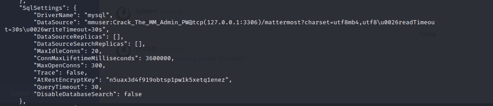

```
$sudo nmap -sS -sV 10.129.138.106
PORT   STATE SERVICE VERSION
22/tcp open  ssh     OpenSSH 7.9p1 Debian 10+deb10u2 (protocol 2.0)
80/tcp open  http    nginx 1.14.2
```

## User

We can create a new ticket on http://helpdesk.delivery.htb/ .
Once we created our ticket there will be an email account created aswell automatically which we can then use to identify at the mettermost server. The mail adress will be our ticket-ID + @delivery.htb. 
So 1234567@delivery.htb for example.
We can read the internal chat and find: 


Looks like someone left something juice for us: Youve_G0t_Mail!

we can use that to ssh into maildeliverer@delivery.htb and get the user.txt.

## Root

For root we only need little enumeration so after finding the config.json 

```
cat /opt/mattermost/config/config.json
```



we got creds for a local mysql server.


which we can use to connect to it:

```
mysql -u mmuser -p 'Crack_The_MM_Admin_PW'
```

Crack the MM Admin PW is already a huge clue so lets select the mattermost database:

```
use mattermost
```
and print all entries for the users:

```
SELECT * FROM Users;
```
there is the hashed admin password which we assume we need to crack since that was the hint: 

```
$2a$10$VM6EeymRxJ29r8Wjkr8Dtev0O.1STWb4.4ScG.anuu7v0EFJwgjjO
```

We already have the information from the chat that we can use a basic rule set to check all variants of common phrases like "PleaseSubscribe!".

So lets do that. We use this rule set: https://github.com/hashcat/hashcat/blob/master/rules/best64.rule and checked on https://www.tunnelsup.com/hash-analyzer/ what kind of hash we have. It's a bcrypt hash which is very common. 


Now we have all the information we need to fire up hashcat:

```
sudo hashcat -m 3200 hash.txt dict.dict -r rule.rule --debug-mode=1 --debug-file=matched.rule --force
```
where -m 3200 is the module id for a bcrypt hash, 
-r rule.rule ist our ruleset
hash.txt ist our hash
and dict.dict is a file which only contains `PleaseSubscribe`
we needed to use --force on the PwnBox, it shouldn't be neccessary elsewhere


we now have our root password with which we can

```
su root
```


